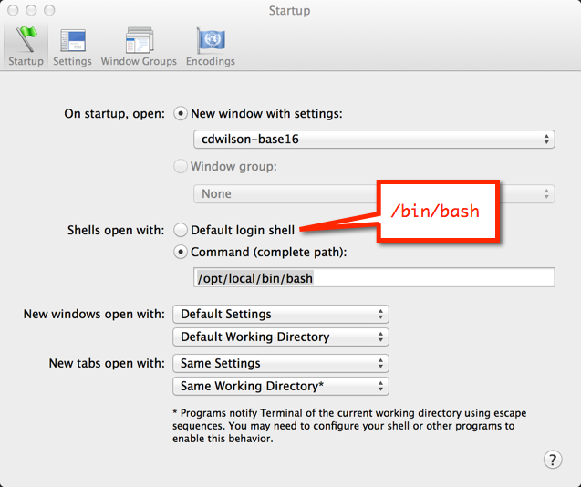

This article is an attempt to answer the following questions[^1]:

* What is the difference between `/etc/profile`, `~/.profile`, `~/.bash_profile`, `~/.bash_login`, and `~/.bashrc`?
* Why doesn't Terminal.app read my `~/.bashrc` on Mac OS X?


## Bash startup

When Bash is invoked, it reads and executes commands from its startup files to set up the shell environment.

There are a couple conditions Bash checks to determine which startup files are read (and which ones are not) when the shell is invoked:

*Am I a login shell?*

* the first character of argument zero is a `-` (i.e. `argv[0][0] == '-'` when the shell is invoked as `-bash`)
* started with the `--login` option

*Am I an interactive shell?*

* started without non-option arguments and without the `-c option`, whose standard input and error are both connected  to terminals
* started with the -i option

This allows for the following four combinations:

|                           | __login shell__             | __non-login shell__             |
| ------------------------- | --------------------------- | ------------------------------- |
| __interactive shell__     | interactive login shell     | interactive non-login shell     |
| __non-interactive shell__ | non-interactive login shell | non-interactive non-login shell |

When you login to a system, the first process spawned under your user ID is usually an __interactive login shell__.  Normally there is some configuration that should only happen once when the user logs in, and Bash provides this capability by sourcing login specific startup files.

First, the login shell sources `/etc/profile`, if that file exists.   Next, it looks for any of the following files in this order: `~/.bash_profile`, `~/.bash_login`, `~/.profile`.  If it finds one that exists and is readable, Bash sources the file.  Bash will also source these same files if the shell is started as a __non-interactive login shell__ when started with the `--login` option.

Additionally, before a login shell exits, Bash reads and executes commands from the file `~/.bash_logout`, if it exists.

Once the user is logged into the system, additional shells can be started within the existing session (for example, from the command line or started with a terminal program like `xterm`).  These are usually invoked as an __interactive non-login shell__ which normally inherits the environment from the parent login shell.  However, since this is not a login shell `~/.bash_profile` is __NOT__ read when Bash is invoked.  Instead, Bash expects settings for interactive non-login shells to be put in `~/.bashrc`, so it reads and executes this file (if the file exists).

If Bash is invoked as a __non-interactive non-login shell__ (for example, to run a shell script), only the environment inherited from the parent shell is used (none of the startup files above will be read).  In addition, it looks for the variable `BASH_ENV` in the environment, expands its value if it appears there, and uses the expanded value as the name of a file to read and execute.

For examples of what should be included in each startup file, [Linux from Scratch] has a good tutorial at [The Bash Shell Startup Files].


### sshd

An exception to the behavior above is when Bash is being executed by the remote shell daemon (rshd or sshd).  When Bash is being run with its standard input connected to a network connection, it reads and executes commands from `~/.bashrc`, if that file exists and is readable.


### Other startup modes

It's important to note that there are other conditions Bash checks which influence the startup behavior.  For example, Bash can be invoked in a compatibility mode with the name `sh` to emulate the behavior of the `sh` shell.  It can also be started in POSIX mode by specifying the `--posix` option.  These and other startup modes are described in detail at [Bash Startup Files].


## Mac

Of course, Terminal.app on Mac [thinks different]...

When you launch Terminal, a new window is opened and the following command is invoked[^2]:

```bash
login -pfl $USER /bin/bash -c exec -la bash /bin/bash
```

The default shell is `/bin/bash`, but can be configured with a custom shell in the Terminal preferences.[^3]



Since Terminal starts each new window as an interactive login shell, `~/.bash_profile` is sourced while `~/.bashrc` is not.

To ensure that `~/.bashrc` is sourced when Bash is invoked as a login shell in Terminal, you need to add the following to `~/.bash_profile`:

```bash
# if this is an interactive shell include ~/.bashrc
[[ $- == *i* ]] && . $HOME/.bashrc
```


## Revision History

| Revision | Date       | Description     |
| -------- | ---------- | --------------- |
| 1        | 10/24/2014 | Initial release |

## Footnotes

[^1]: If you're wondering, "why Bash?", see [Shell Script Basics] from the [Mac Developer Library].

[^2]: <http://apple.stackexchange.com/questions/114830/what-options-does-terminal-pass-to-bash-on-startup>

[^3]: Bash completion from MacPorts requires Bash version 4.1 or later, and at the time of this writing, the version of Bash that ships with OS X is too old (3.2.51(1)-release on Mavericks).  Make sure to toggle _Terminal_ -> _Preferences_ -> _Startup_ -> _Shells open with_ to _Command (complete path):_ `/opt/local/bin/bash`. For more details, see the [Bash Completion How To].

[Shell Script Basics]: https://developer.apple.com/library/mac/documentation/opensource/conceptual/shellscripting/shell_scripts/shell_scripts.html#//apple_ref/doc/uid/TP40004268-CH237-SW3
[Mac Developer Library]: https://developer.apple.com/library/mac/navigation/
[Bash Startup Files]: https://www.gnu.org/software/bash/manual/html_node/Bash-Startup-Files.html
[thinks different]: http://www.youtube.com/watch?v=nmwXdGm89Tk
[Bash Completion How To]: http://trac.macports.org/wiki/howto/bash-completion
[Linux from Scratch]: http://www.linuxfromscratch.org
[The Bash Shell Startup Files]: http://www.linuxfromscratch.org/blfs/view/svn/postlfs/profile.html
