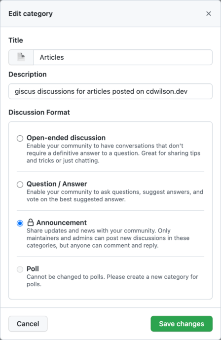

After looking into a [couple](https://getreplybox.com/) [different](https://talk.hyvor.com/) [hosted](https://fastcomments.com/) [options](https://commento.io/) for enabling comments on this site, I decided to give [giscus](https://giscus.app/) a try.  

This article describes why I chose giscus and how to set it up in a Hugo site.

# First: why giscus?

It's worth talking through the thought process for how I landed on giscus, as it's probably not the right option for everybody.

Derek Kay has an [excellent article](https://darekkay.com/blog/static-site-comments/) which explores various ways to include comments on a static site.  After reviewing many of the options he mentioned in the article, I found that I mostly agree with his conclusion:

>  There is no [silver bullet](https://www.youtube.com/watch?v=3wyd6J3yjcs). The *best* method depends on your requirements:
>
> - How much time are you prepared to invest in the setup/moderation?
> - How important is performance/privacy/data ownership to you?
> - Who is your target audience?
> - Do you want to build a community?

None of the options listed in his article were a perfect solution for me, including giscus.  However, I found giscus to be the best option given my specific requirements for this site.

**Requirement #1:** Have comments on this site.

This might seem like a silly one to start with, but I don't get many comments on this site and I seriously considered simply not having comments at all.  However, after reading Jeff Atwood's [a blog without comments is not a blog](https://blog.codinghorror.com/a-blog-without-comments-is-not-a-blog/), I resonated with the idea that having *the option* to post a public comment adds value.  When I post an article on this site, it's usually because I'm exploring something new that I might not fully understand myself.  Selfishly, I'm hoping that the comments will provide opportunities for a conversation that helps me to learn from other people and fill in gaps in my own understanding.

**Requirement #2:** No monthly cost.

This one is pretty simple: I can't justify paying for comments when this site doesn't generate any revenue.  This rules out all the paid third-party providers.  If this wasn't a requirement, I would probably have paid for [ReplyBox](https://getreplybox.com/).

**Requirement #3:** No adds, no tracking.

Comments are important, but not at any cost.  If you post a comment on this site, I want you to feel respected, and that includes respecting your privacy online.  That rules out free options like [disqus.com](https://disqus.com/) that have [privacy](https://www.businessinsider.com/disqus-launches-advertising-2014-11) (and performance) concerns.

**Requirement #4:** No maintenance overhead.

Having to maintain a self-hosted comment solution felt like it defeated the "set it and forget it" simplicity of this static site.  I don't want to deal with maintaining a separate self-hosted service just for comments.

**Requirement #5:** Login required to comment.

This one might seem a little counterintuitive, but I wanted there to be a little friction required to post a comment.  Mainly to prevent spam, but also to ensure that there was some intention and thought required before someone can blast away with "this article is trash and you suck."

While I'm not totally thrilled that giscus *requires* a GitHub login, any option that doesn't allow anonymous comments will require some kind of login (or at least name + email).  I figure that the audience for this site will be mostly technical, so the chances that they already have a GitHub login are pretty high.

**Requirement #6:** Low "[bus factor](https://en.wikipedia.org/wiki/Bus_factor)" risk.

I didn't want a solution that would be jeopardized if the maintainer got hit by a bus (or was otherwise not inclined to keep working on the product).  Although it's not a guarantee of longevity, having an open-source comments system backed by widely used product from a major organization (e.g. GitHub Discussions) minimizes the risk that I'll have to migrate to something else any time soon.  If I do have to migrate to something else in the future, it should be relatively easy to export the comments for this site using the GitHub API.

**Requirement #7:** Minimize the number of tools.

I'm already using GitHub to host [the source](https://github.com/cdwilson/cdwilson.dev) for this site.  Having the comments system integrated into the same tool as the site's source control enables convenient workflows like creating issues directly from comments in the discussions.

**Requirement #8:** Integrated comments and community discussion forum.

I wanted an integrated solution that could support forum-style discussion threads in addition to comments on individual articles.  This can be done with discourse (e.g. https://blog.codinghorror.com/), but I didn't want to pay [$100/mo for a hosted instance](https://www.discourse.org/pricing) or have to deal with [hosting it myself for free](https://jlericson.com/2021/04/06/oracle_discourse.html).

# How to set up giscus comments in Hugo

The https://giscus.app page has a configuration questionnaire that will automatically generate a `<script>` tag that can be embedded in your site.  

In order to make the options configurable via Hugo's `config.toml` file, we can create a [Hugo partial template](https://gohugo.io/templates/partials/) in `layouts/posts/giscus.html`:

```html
{{- if isset .Site.Params "giscus" -}}
  {{- if and (isset .Site.Params.giscus "repo") (not (eq .Site.Params.giscus.repo "" )) (eq (.Params.disable_comments | default false) false) -}}
  <script src="https://giscus.app/client.js"
    data-repo="{{ .Site.Params.giscus.repo }}"
    data-repo-id="{{ .Site.Params.giscus.repoID }}"
    data-category="{{ .Site.Params.giscus.category }}"
    data-category-id="{{ .Site.Params.giscus.categoryID }}"
    data-mapping="{{ default "pathname" .Site.Params.giscus.mapping }}"
    data-reactions-enabled="{{ default "1" .Site.Params.giscus.reactionsEnabled }}"
    data-emit-metadata="{{ default "0" .Site.Params.giscus.emitMetadata }}"
    data-input-position="{{ default "bottom" .Site.Params.giscus.inputPosition }}"
    data-theme="{{ default "light" .Site.Params.giscus.theme }}"
    data-lang="{{ default "en" .Site.Params.giscus.lang }}"
    data-loading="{{ default "lazy" .Site.Params.giscus.loading }}"
    crossorigin="anonymous"
    async>
  </script>
  {{- end -}}
{{- end -}}
```

Then, we can include this partial in the footer of the post template (e.g. `layouts/posts/single.html`):

```html
<footer>
  {{ partial "posts/giscus.html" . }}
</footer>
```

Finally, we can configure the options in the site's `config.toml` file:

```toml
[params.giscus]
repo = "cdwilson/cdwilson.dev"
repoID = "R_kgDOGzJrfg"
category = "Articles"
categoryID = "DIC_kwDOGzJrfs4CP2TM"
mapping = "og:title"
reactionsEnabled = "1"
emitMetadata = "0"
inputPosition = "bottom"
theme = "light"
lang = "en"
loading = "lazy"
```


I created a dedicated category in GitHub discussions specifically for discussing articles posted on this site.  It is recommended to use a category with the "Announcement" type so that new discussions can only be created by maintainers and giscus.


