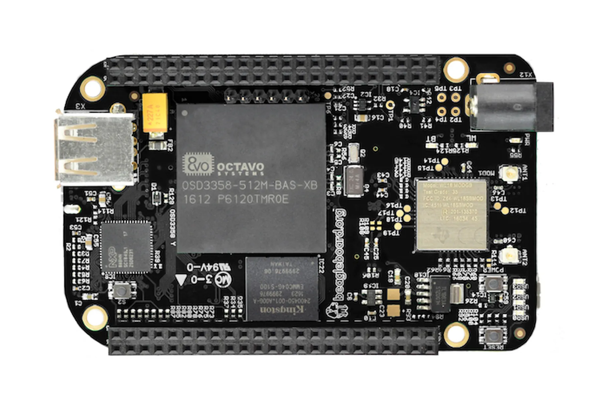
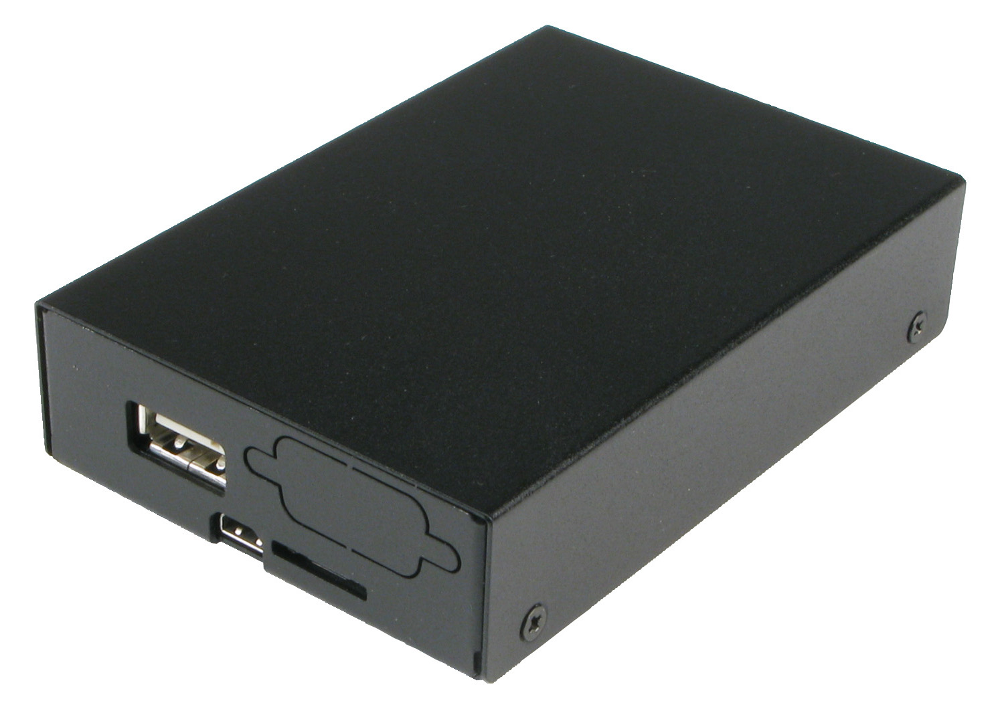

Raise your hand if you came here because you thought that the title of this article was preposterous? 🙋🏻‍♂️

Ok...I'll admit, the title is ~~wrong~~ *a tiny bit clickbaity*.  Obviously, we're never going to debug embedded systems without some wires involved.

But you're here now (ha!), so let's get on with it.

This articles isn't all lies and broken promises.  I'm going to show you how to leave that spaghetti mess of USB-based dev boards and J-Link probes behind so you can work from a [laptop tied to a tree in the wilderness](https://mgsloan.com/posts/tree-based-computing/) or a [hammock under your deck](https://mgsloan.com/posts/ergo-update-hammock-under-deck/).

# The secret sauce

A while back I ran across a tweet from [@jaydcarlson](https://twitter.com/jaydcarlson) where he mentioned "doing USB over IP with VirtualHere".



It turns out that [VirtualHere](https://www.virtualhere.com/home) is a ✨magical✨ piece of software that can make USB devices plugged into one computer (the "server") show up as if they are directly attached to another computer (the "client").

Any USB device you want to access remotely is directly connected to a "server" running the VirtualHere server software.   The VirtualHere server runs entirely in userspace and is statically complied (no linux run-time libraries are required on the server).  It can be installed on a wide variety of devices and operating systems, ranging from embedded devices like a [Raspberry Pi](https://www.raspberrypi.org/) to x86_64-based servers.

Once the server is running, any "client" running the VirtualHere client software can "use" any of the USB devices attached to the server.  These USB devices appear to the client as if they were directly attached to the client's USB ports–the client has no knowledge that the USB device is being shared over the network. 

# How to do the thing

OK, this sounds amazing, right?  I had to try it out immediately.

I went rummaging through my ~~hoarder box~~ well-organized inventory of dev boards looking for an embedded system that could host the VirtualHere server.  I found an old [BeagleBone Black Wireless](https://beagleboard.org/black-wireless) that seemed perfect for the job–it's small, runs Linux, has built in Wi-Fi, and has a USB host port.

I had even purchased a sheet-metal enclosure at some point from Logic Supply.

The remainder of this article will use the BBBW as the "server", but it looks like the Rasberry Pi is also fully supported.  FWIW, the BeagleBone appears to be [recommended](https://virtualhere.com/comment/3149#comment-3149) by the author of VirtualHere over the Raspberry Pi:

> I recommend a beaglebone black rather than a pi because the ethernet interface is not shared with the usb ports and the kernel support from texas instruments is very good.
