# The idea

I've been wanting to set up a small electronics workspace in my home office for a while now.  The main goal was to have an ESD-safe area in the office where I could do bring-up and testing for projects that require a connection to a computer and test equipment.  I already have a separate full size electronics workbench in the garage (SMT reflow oven, hot air rework, microscope, etc), so this was intended as a more focused compliment to that space, rather than a replacement for it.

I've made a couple small improvements since this original tweet, so I wanted to post a follow-up with a more detailed look at the build process and some of the things I learned along the way.



# The requirements

1. Electronics workspace & test equipment within arm's reach
2. Shelves or racks for test equipment
3. (Relatively) ESD safe workspace
4. Don't break the bank!

# The setup

I have an old "L"-shaped IKEA Galant corner desk that I wanted to keep as the base for the workspace.  These desks are super sturdy and it's easy to reconfigure them with extensions to fit your unique space.  If you're looking for inspiration, check out [r/ikeahacks](https://www.reddit.com/r/ikeahacks/) for cool stuff people have done with IKEA furniture.

The optional Galant extension leaf for my desk is $31\frac{1}{2}''\times23\frac{5}{8}''$, which I figured would be large enough for most of the projects I work on (usually small microcontroller-based boards):

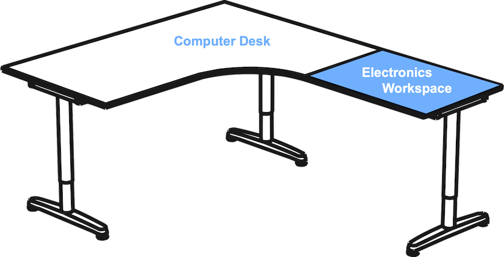

Although [IKEA stopped selling the Galant series in 2014](https://www.businessinsider.com/ikea-is-killing-the-galant-desk-2014-7), they are still really easy to find on craigslist since they were the desk of choice for many startups in the 2000s.

## Installing the test equipment shelf

Since the electronics workspace is less than 3ft wide, I wanted to maximize the work surface by raising the test equipment up on some kind of rack or shelves.

After looking at a couple different shelving options, I eventually discovered the [height extension unit for the IKEA BILLY bookshelf](https://www.ikea.com/us/en/p/billy-height-extension-unit-white-40263853/) is exactly the same width as the Galant desk extension ($31\frac{1}{2}''$).  With the addition of an [optional extra shelf](https://www.ikea.com/us/en/p/billy-extra-shelf-white-20265301/), I found that it makes a nice compact test equipment storage "rack".  For $40, this turned out to be the cheapest and best-fitting option.

The BILLY shelf is normally designed to be secured onto the top of a BILLY bookshelf.  However, I needed the shelf to be secured to the Galant desk extension instead, so I installed the included cam-lock screws directly into the desktop.

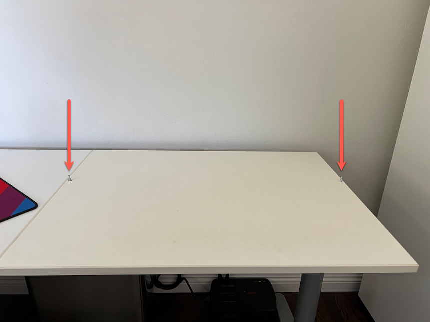

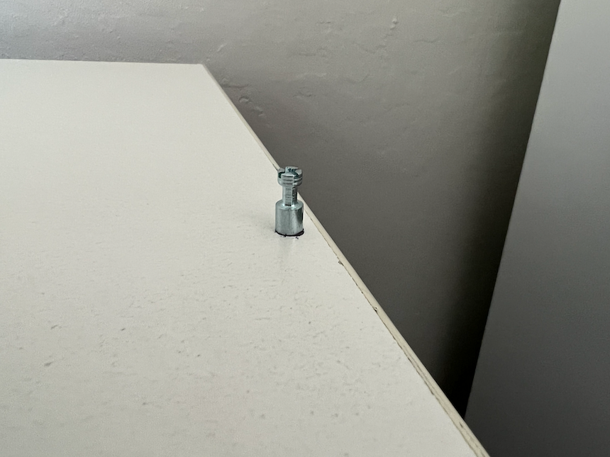

Once the cam-lock screws were installed, it was easy to secure the shelf to the desk extension.

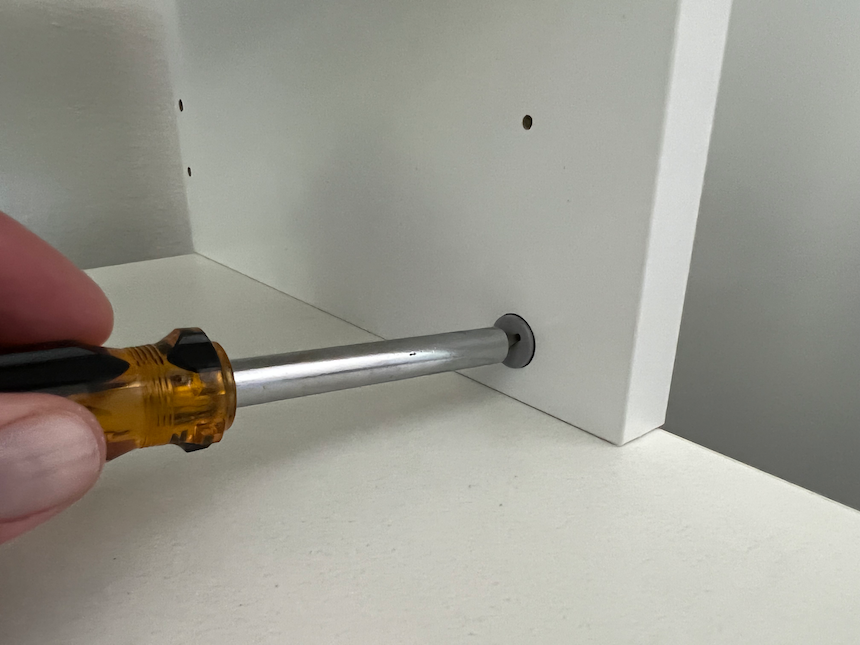

It fits perfectly! 🎉

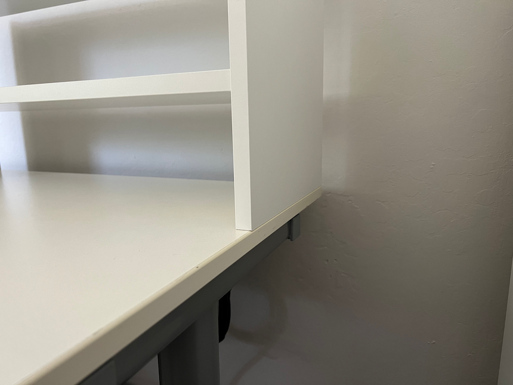

I chose not to install the rear panel of the BILLY shelves because some of the test gear is a bit longer than the depth of the shelf, and the power supply cables need a way to exit the rear of the shelf.

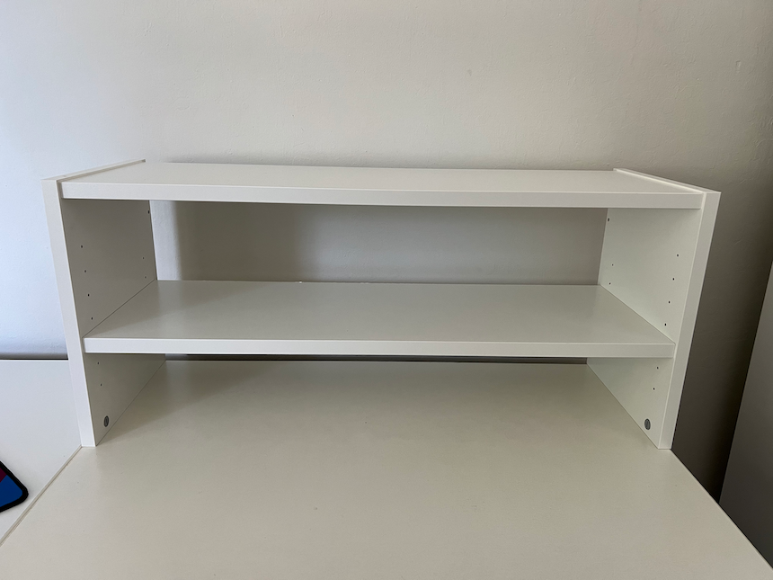

The BILLY shelves are stackable, so if you need more than 2 shelves, you can buy additional units as needed and stack them to store more gear.

## Creating an ESD Protected Area

I wanted to reduce the risk of an [electrostatic discharge (ESD)](https://en.wikipedia.org/wiki/Electrostatic_discharge) event damaging a board I'm working on.  This involved setting up an [“ESD Protected Area” (EPA)](https://scs-static-control-solutions.blog/2018/10/18/how-to-create-an-esd-protected-area-at-an-existing-workstation/) with a grounded anti-static work surface mat and wrist strap.

[ESD matting](https://www.antistat.co.uk/blog/2017/12/05/everything-need-know-esd-matting-probably/) is designed to drain any buildup of static charge from items placed on its surface.  It can be made with either vinyl or rubber, or a combination of the two (known as "Homogenous").  Vinyl mats are the most widely used because they are cost-effective, easy to cut to shape and provide excellent static dissipation.  The vinyl matting comes in 2 or 3-layers, where the 3-layer has better electrical properties, but is more expensive.  I'd recommend going with a 3-layer vinyl mat unless you need the high resistance to heat and/or chemicals provided by rubber mats.

[ESD wrist straps](https://scs-static-control-solutions.blog/2017/11/30/an-introduction-to-wrist-straps/) are designed to provide a safe electrical connection between your skin and common workstation ground point.  For safety, the wrist straps have an inline 1MΩ resistor which limits the current through your body in case of an accidental contact with high voltages up to 250VAC.  They can come in a variety of band styles: [metal](https://store.unitedesd.com/WS_1037_Metal_Expansion_Plastic_Encapsulated_Wrist_p/ws-1037.htm), [cloth](https://store.unitedesd.com/WS_1020_Premium_ESD_Wrist_Strap_p/ws-1020.htm), or [gel](https://store.unitedesd.com/ESD_Gel_Wrist_Strap_and_Coil_Cord_p/w00404.htm).  I find the cloth bands to be the most comfortable, but they are cheap enough that you could probably pick up one of each and decide what works best for you.

I ended up purchasing a [Bertech ESD Anti-Static Vinyl Mat Kit (3059-24x30BKT)](https://www.amazon.com/gp/product/B08722C28D) because it comes with the mat and the wrist strap as a kit, and it fits *PERFECTLY* in the 30" wide opening of the IKEA shelf (no cutting of the ESD mat required):

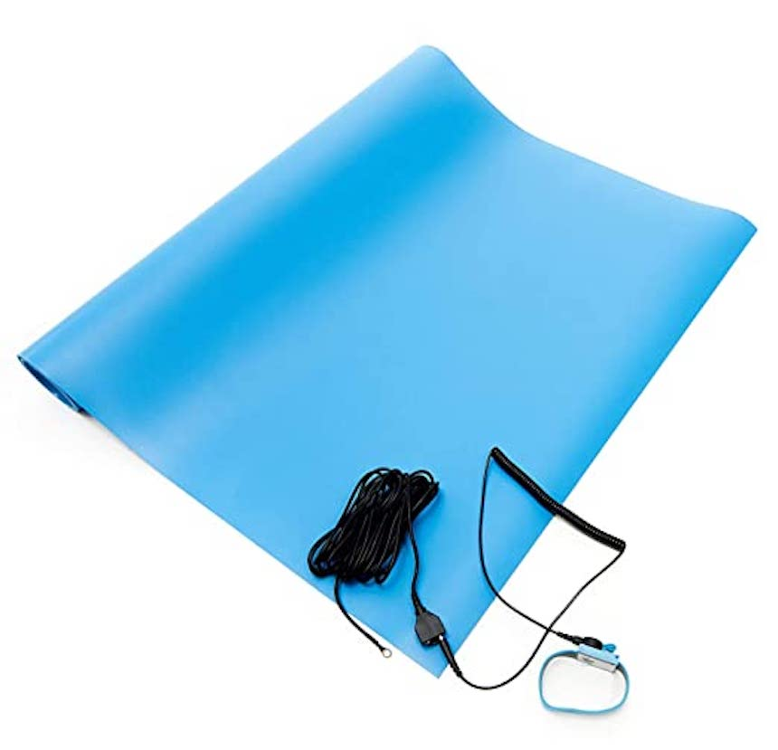

I used some velcro tape to secure the mat to the desktop to prevent it from sliding around:

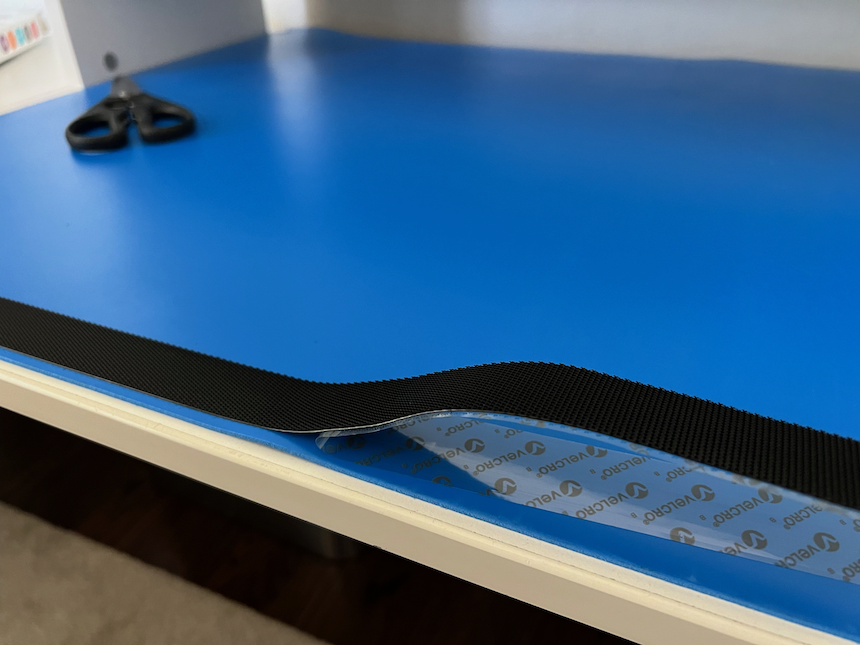

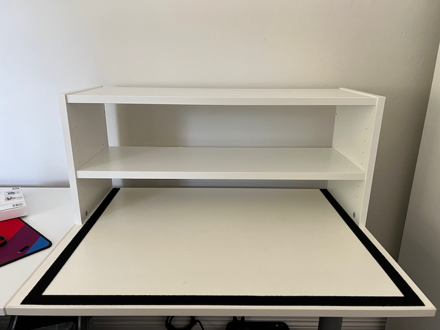

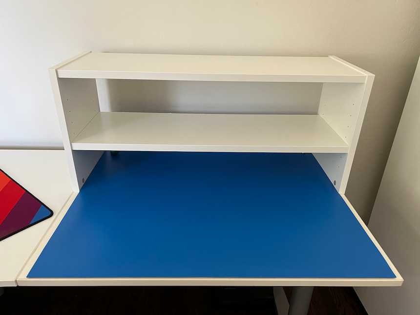

**How do we ground the mat?**

The ESD protection provided by the mat is only effective if the mat is grounded.

The mat kit comes with a grounding cord that connects the 10 mm snap on the mat to an "eyelet" (a #10 ring terminal) for a screw connection to earth ground.  Many NEMA 5-15R power outlets in the US have a grounded center screw that can be used for this purpose.

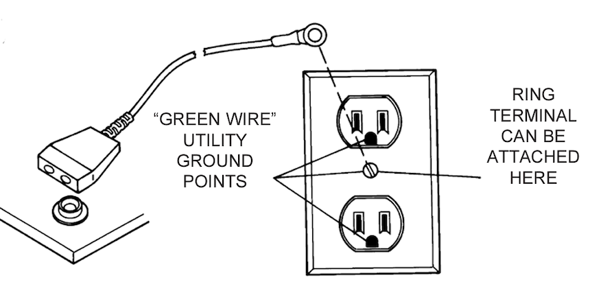

However, I wanted an easier/cleaner way to ground the mat to the power strip under my desk, so I purchased a [Prostat PGC-015Q Green Ground Cord & Qube](https://www.amazon.com/dp/B0060AG7W4) adapter.  The "Qube" ground plug adapter comes with a banana jack cable to connect the 10 mm snap on the mat to a NEMA 5-15R outlet's ground pin.  The wrist strap can be connected to one of the two female banana jack receptacles on the 10 mm snap end of the cable:

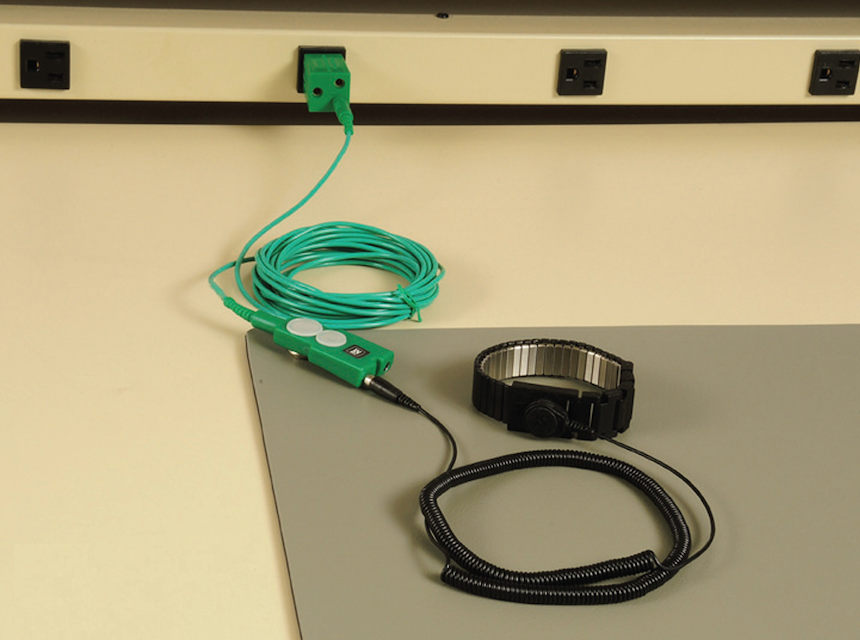

Once everything is properly connected, you and your workstation should be at the same electrical potential.  Ideally, no more shocky shocky ⚡️ to your sensitive blinky blinkies 🤖!

**But wait... how do we verify that everything is properly grounded, and more importantly, *stays* grounded over time?**

Cables can come loose and wrist straps can fail, so it's possible that you think you're grounded when you're actually not.  There are devices that can continuously monitor both the ESD mat and wrist strap's connection to ground, and provide an audible alert if one of those connections fails.  These *Continuous Monitors* are generally classified by whether they are designed for use with a [single-wire vs. dual-wire](https://scs-static-control-solutions.blog/2017/12/14/comparing-single-wire-and-dual-wire-monitors/) wrist strap.  Single wire monitors are the cheapest (\\$100ish) and most common.  Dual-wire monitors were developed to address some of the problems with single-wire wrist straps, but are usually more expensive (\\$200+).  Some of the better single-wire monitors (like the [Aratron AEI-DT020](https://www.aratron.us/aei-dt020.htm)) have a dual threshold feature that can detect failure of the safety resistor in the wrist strap in addition to monitoring the ground connection of the operator.

**So what should you get?**

If I was drowning in cash 🤑, I'd grab a fancy dual-wire monitor like the [SCS CTC331-WW](https://staticcontrol.descoindustries.com/SCSCatalog/Static-Control-Monitors/Workstation-Monitors/Iron-Man-Plus-Monitor/CTC331-WW/#.YrAAlezMI0Q) which has an additional monitoring channel for detecting over-voltage events from hand tools while working on the PCB (soldering iron, tweezers, etc).  This is probably overkill for most home labs.

If I was purchasing a brand new single-wire monitor in the $100 range, I'd buy the following dual threshold monitor + accessories:

- [Aratron AEI-DT020](https://store.unitedesd.com/ESD_Wrist_Strap_and_Mat_monitor_dual_threshold_p/dt-020.htm)
- [Metal Mounting Bracket for the ST or DT 020 Series](https://store.unitedesd.com/wrist_strap_monitor_metal_mounting_bracket_p/9202-brk.htm) (mounts the monitor to the underside of the desk)
- [Secure Monitor to Mat Adapter for the DT and ST Series](https://store.unitedesd.com/ESD_Wrist_strap_constant_monitor_single_threshold_p/gc-mini.htm) (connects the monitor directly to the 10 mm snap on the mat)

However, I'm cheap... so, I bought a broken [Botron B9202](https://www.botron.com/product/single-operator-and-mat-continuous-monitor/) single-wire monitor on eBay for $15 and fixed the BNC jack myself.

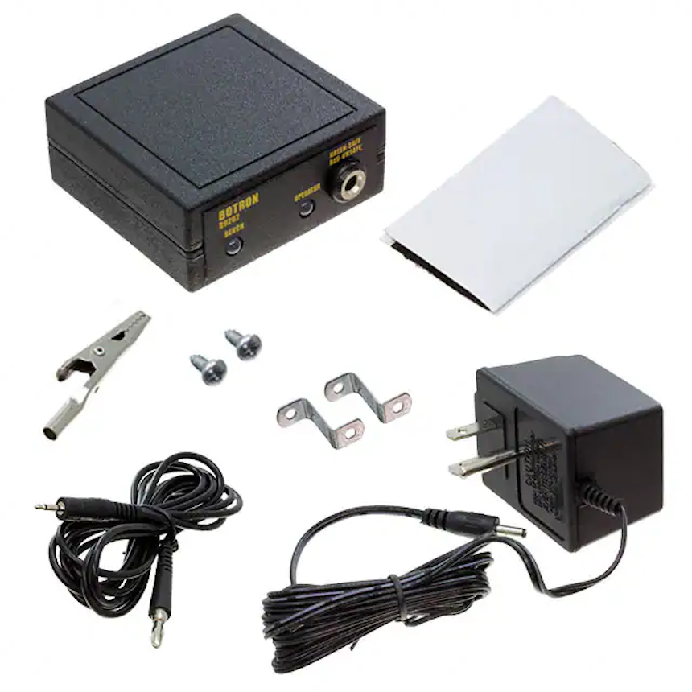

A quick aside: my electronics workbench in the garage has a [Statico S2555](https://statico.com/products/s2555) which looks nearly identical to the B9202... could they be the same? 🤔

Taking them both apart revealed that they have exactly the same PCB!

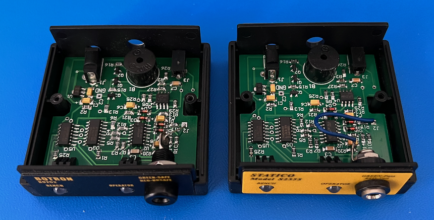

My suspicion is that all the single-wire AC Capacitance Monitors in this form factor are all just white-labeled units built by [HZR](https://www.esd-hzr.com/) in Shenzhen.  The takeaway: I think the only difference between the various brands is what accessories come with the unit (mounting brackets, cables, etc).

**OK, so how do we hook this Continuous Monitor up?**

Here's the connection diagram for the [Aratron AEI-ST020](https://www.aratron.us/aei-st020.htm) (which is functionally identical to the B9202 & S2555):

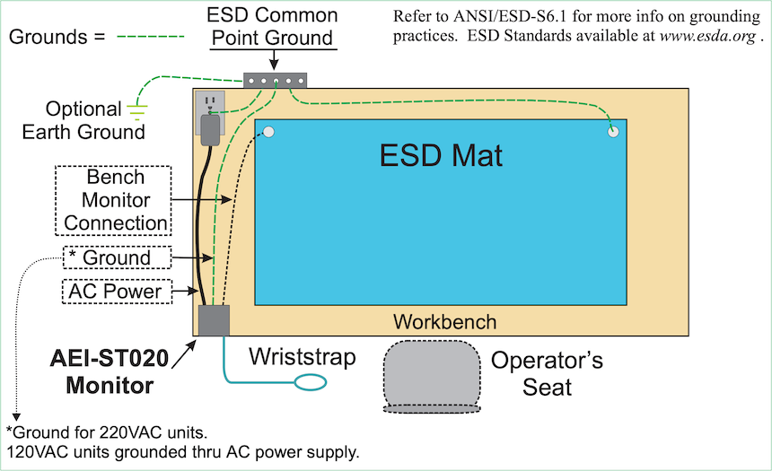

1. Connect the included power supply to the monitor and to a grounded power outlet.  The unit is grounded through the power supply, so no need for a separate ground connection on the monitor itself.
2. Connect the "Bench System Ground" connection on the back of the monitor to one of the 10 mm snaps on the ESD mat.  I wanted to use the cable that was included with my monitor, so I had to pick up some banana jack-to-10 mm adapters (e.g. [Transforming Technologies CS0127](https://www.digikey.com/short/qj91q8zh)) to connect it to the snap on the mat.  Alternatively, you can just buy one of these integrated cables instead: [Secure Monitor to Mat Adapter for the DT and ST Series](https://store.unitedesd.com/ESD_Wrist_strap_constant_monitor_single_threshold_p/gc-mini.htm)
3. Connect the green Prostat mat grounding cable to the other 10 mm snap on the ESD mat (the monitor should not be plugged into the same snap as the mat's ground wire)
4. Plug the wrist strap into the "Operator" banana jack connection on the front of the monitor

Here's what it looks like installed on the underside of my desk:

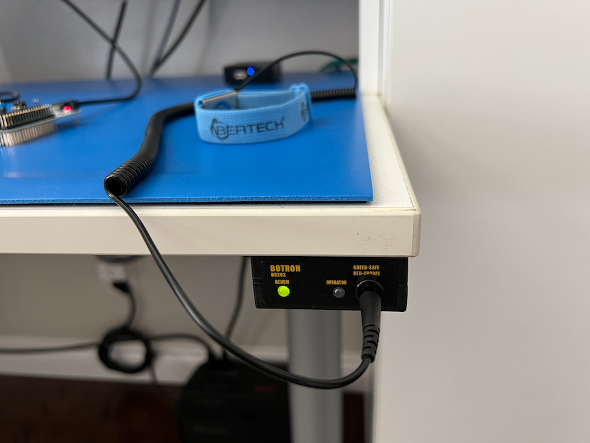

Now, I get an audible alert 🔔 whenever the ground connection on the mat or the wrist strap is disconnected 👍

**Trust but verify [the monitor]**

When I was looking for continuous monitors on eBay, I came across a [Statico MTB1](https://statico.com/products/mtb1) test box for the S2555 monitor.  These test boxes let you easily verify whether the continuous monitor itself is performing correctly.  It was only $5... so no brainer, I bought it just to check it out.

Here's how it's supposed to work:

- When you push the "OPERATOR" button, it should simulate an operator's wrist strap being connected to the monitor, so the "OPERATOR" light on the monitor should turn green 🟢
- When you push the "BENCH" button on the monitor, it should simulate a failure of the bench ground connection, so the "BENCH" light on the monitor should turn red 🔴

However, when I tried to actually use the tester, it didn't work 😢 (nothing happened when I pushed the buttons).  As soon as I opened it up, I realized why... there was nothing inside the box except a couple 100kΩ resistors soldered directly to the switches.  Someone had obviously removed the original electronics...sigh...

Not all is lost!  Surprisingly, the [MTB1 datasheet](https://cdn.shopify.com/s/files/1/0446/9925/files/MTB1_febd12c2-3a12-4ae9-9de0-4f4131ff8f5d.pdf?v=1584375119) has a circuit diagram:

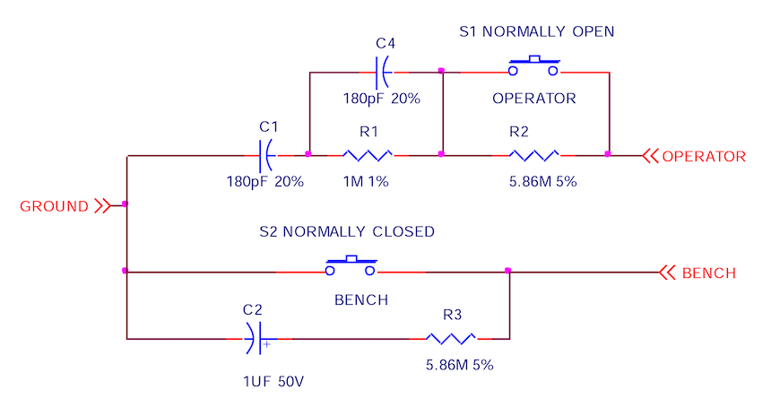

I used the schematic above to hack together the correct circuit on a bit of SparkFun protoboard and voilà!

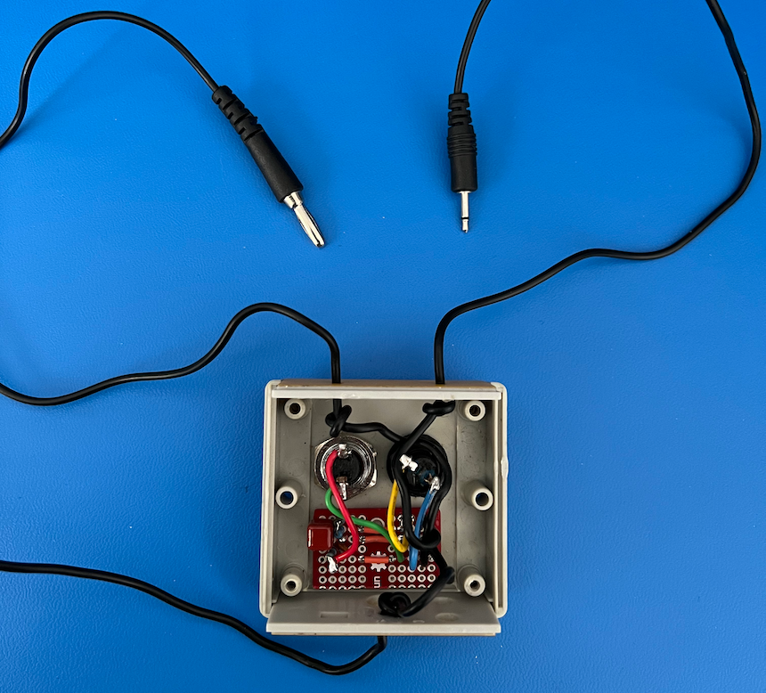

It works again!

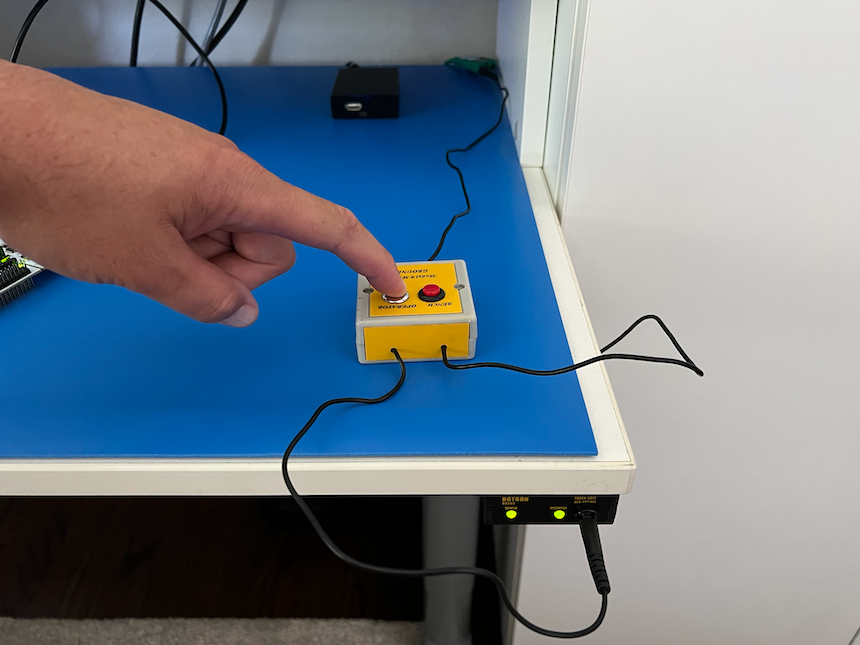

**An ESD intermezzo**

If you want the most...shall we say..."entertaining" and informative introduction to ESD, check out this video from the inventor of the original pink poly ESD bag:



# USB hub with individual power switches

Ever get tired plugging and unplugging USB cables to power cycle an embedded device?  🙋🏻‍♂️

Well, it turns out that you can buy USB hubs with individual power switches for each port.  I picked up an [ACASIS 10-Port USB 3.0 Hub](https://www.amazon.com/dp/B07Q3TYF15) and so far I've been pretty happy with it.  They also sell a [7-Port](https://www.amazon.com/dp/B07Q5X1292) and a [16-Port](https://www.amazon.com/dp/B07JM9ZFFV) version if you need less/more USB ports.

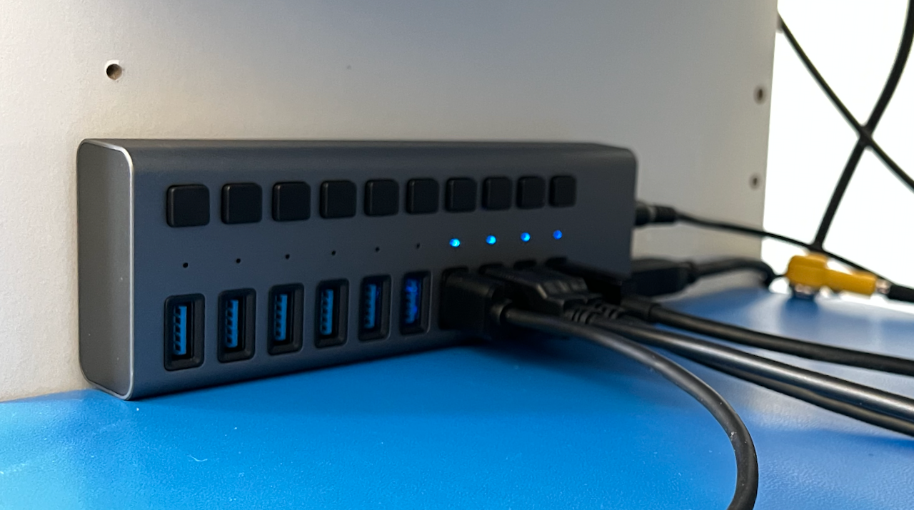

# The final result

Overall, I'm pretty happy with how the workspace turned out!

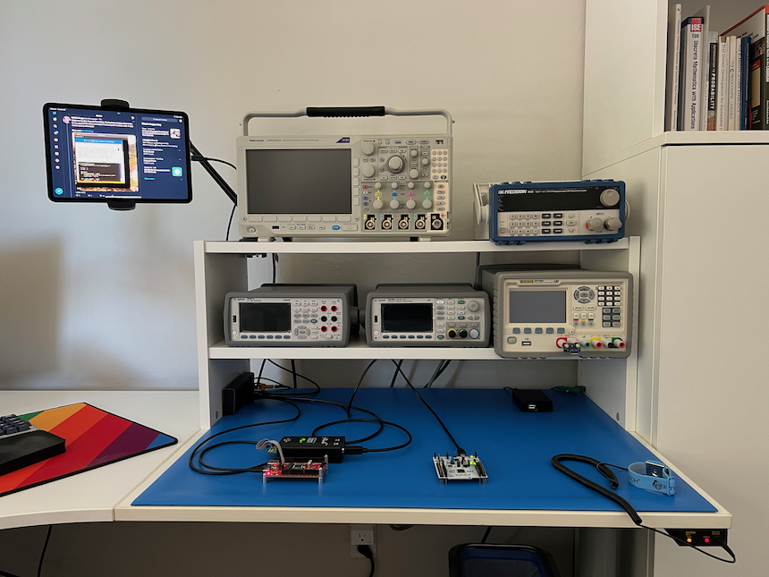

Anything I got wrong?  Any suggestions for other helpful tools I should know about?  Let me know in the comments below.