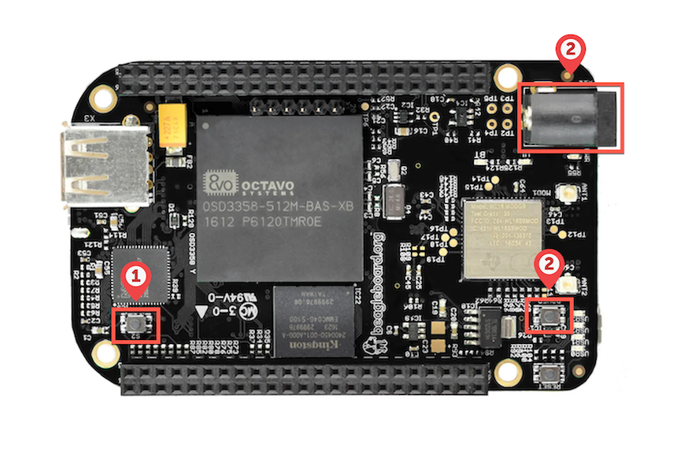

Raise your hand if you're tired of having a spaghetti mess of USB hubs and dongles hanging off your laptop?  🙋🏻‍♂️

I'm going to show you how to leave all those USB devices behind and remotely connect to them over the network instead.  Yup, you heard right–you'll *finally* be able to work from a [laptop tied to a tree](https://mgsloan.com/posts/tree-based-computing/)!  (or at least from the comfort of your own couch…)

# VirtualHere

A while back, I was looking for a way to fire up the debugger on a [STM32 NUCLEO development board](https://www.st.com/en/evaluation-tools/stm32-nucleo-boards.html) without having the board directly connected to one of my laptop's USB ports.


In a moment of serendipity, I ran across a tweet from [@jaydcarlson](https://twitter.com/jaydcarlson) where he mentioned "doing USB over IP with VirtualHere".



It turns out that [VirtualHere](https://www.virtualhere.com/home) is a ✨magical✨ piece of software that can **make USB devices plugged into one computer (the "server") *appear* as if they are directly attached to another computer (the "client")**.

Any USB device you want to access over the network must be directly connected to a "server" running the VirtualHere server software.   The VirtualHere server runs entirely in userspace and is statically complied (no linux run-time libraries are required on the server).  It can be installed on a wide variety of devices and operating systems, ranging from embedded devices like a [Raspberry Pi](https://www.raspberrypi.org/) to x86_64-based servers.

Once the server is running, any "client" running the VirtualHere client software can remotely "use" any of the USB devices attached to the server.  These USB devices appear to the client as if they were directly attached to the client's USB ports–the client has no knowledge that the USB device is being shared over the network.


# Choosing the server hardware

Sounds amazing, right?  The first step is to set up the server hardware.

My initial thought was to purchase a [Raspberry Pi 4 Model B](https://www.raspberrypi.com/products/raspberry-pi-4-model-b/) since it has multiple USB ports built in.  However, it appears to be [completely out of stock](https://octopart.com/search?q=RPI4-MODBP).

Instead, I went rummaging through my ~~hoarder box~~ well-organized inventory of dev boards looking for an embedded system that could host the VirtualHere server.  I found an old [BeagleBone Black Wireless](https://beagleboard.org/black-wireless) (BBBW) that seems perfect for the job–it's small, runs Linux, has built in Wi-Fi, and has a USB host port.



The remainder of this article is tailored towards using the BeagleBone Black Wireless as the "server" in the examples.  These same instructions should also work with the [BeagleBone Black](https://beagleboard.org/black) if you want to connect the USB devices to ethernet instead of Wi-Fi.  While the Raspberry Pi appears to be fully supported, I haven't tested it myself.  Also worth noting, the BeagleBone appears to be [recommended](https://virtualhere.com/comment/3149#comment-3149) by the author of VirtualHere over the Raspberry Pi:

> I recommend a beaglebone black rather than a pi because the ethernet interface is not shared with the usb ports and the kernel support from texas instruments is very good.




I had even purchased a [sheet-metal enclosure](https://linuxgizmos.com/beaglebone-black-gains-15-dollar-metal-enclosure/) at some point from Logic Supply, which makes the BBBW feel more like an end-user device rather than a bare dev board lying around on my desk.  I don't think they make this enclosure any longer, but it's worth getting something similar to protect the board from accidental shorts.


# Connecting to the Serial Console

Since we're going to be using the BBBW in "headless" mode without a display or keyboard attached, we need to temporarily connect to the serial console so that we can log into the system for the initial configuration.  Once the system is set up, the connection to the serial console will no longer be needed.

The BBBW serial console is exposed as a 3.3V UART on header "X1".  The easiest way to connect to this header is by using an [FTDI TTL-232R-3V3](https://www.digikey.com/short/ndt33nb9) USB-to-Serial cable, which can be plugged directly onto the header pins.  Other cable options are listed [here](https://elinux.org/Beagleboard:BeagleBone_Black_Serial).


On a PC, open a connection to the virtual serial port with the following settings.  If you're on a Mac, I **highly** recommend using [Serial 2 from Decisive Tactics](https://www.decisivetactics.com/products/serial/).

| Setting   | Value  |
| --------- | ------ |
| Baud      | 115200 |
| Bits      | 8      |
| Parity    | N      |
| Stop Bits | 1      |
| Handshake | None   |

After pressing `ENTER` you should see a prompt (your prompt may be different depending on what image the BBBW is running):

```bash
Debian GNU/Linux 11 BeagleBone ttyS0

BeagleBoard.org Debian Bullseye Minimal Image 2022-07-01
Support: https://bbb.io/debian
default username:password is [debian:temppwd]

BeagleBone login:
```

# Flashing the base Linux image

Before we install the VirtualHere server, we need to make sure the base Linux image on the BBBW is up to date.

The BBBW can boot from either the microSD card or the onboard 4GB eMMC flash storage.  We're going to use the eMMC, so we need to reprogram the flash storage with a new base Linux image built for the TI AM335x Sitara processor.

I ended up using the latest [Debian 11.x (Bullseye) Minimal Snapshot](https://forum.beagleboard.org/t/debian-11-x-bullseye-monthly-snapshots/31280) built by [Robert Nelson](https://forum.beagleboard.org/u/RobertCNelson).  The exact image I used is [am335x-debian-11.3-minimal-armhf-2022-07-01-2gb.img.xz](https://rcn-ee.com/rootfs/bb.org/testing/2022-07-01/bullseye-minimal-armhf/am335x-debian-11.3-minimal-armhf-2022-07-01-2gb.img.xz) but any recent image built for the AM335x should work.

The image above is designed to be run from a microSD card, but it contains a script that can be used to flash the eMMC once the system has booted from the microSD card.  After the image is flashed to the eMMC, the SD card is no longer needed.

The easiest way to program the image onto the microSD card is to use [balenaEtcher](https://www.balena.io/etcher/).  Etcher will ask you to select the image file and the microSD media device.  Etcher will uncompress the image as part of the flashing process, so you can just choose the compressed .xz image (no need to extract it first).


Once the image has been written to the microSD card, insert it into the BBBW.  Hold down the "S2" boot switch (1) and apply power to the device (2) (either by pressing the `POWER` button or by inserting the 5V power supply into the barrel jack).  Holding the "S2" switch will force the BBBW to boot from the microSD card instead of the eMMC flash.



Once the image has booted from the microSD card, you should see a login prompt.  Login with the username `debian` and the password `password`

```bash
Debian GNU/Linux 11 BeagleBone ttyS0

BeagleBoard.org Debian Bullseye Minimal Image 2022-07-01
Support: https://bbb.io/debian
default username:password is [debian:temppwd]

BeagleBone login: debian
Password: temppwd
```

After logging in, you should see a prompt like the following:

```bash
The programs included with the Debian GNU/Linux system are free software;
the exact distribution terms for each program are described in the
individual files in /usr/share/doc/*/copyright.

Debian GNU/Linux comes with ABSOLUTELY NO WARRANTY, to the extent
permitted by applicable law.
Last login: Sun Jul  3 18:56:45 UTC 2022 on ttyS0
debian@BeagleBone:~$
```

Next, we're going to update the U-Boot bootloader.  Type the following command at the prompt:

```bash
sudo /opt/u-boot/bb-u-boot-am335x-evm/install.sh
```

Now, let's configure the system to flash the image to the eMMC.  Once the system reboots, the flashing process will begin (it will take 5-10 minutes for the flashing process to complete):

```bash
sudo enable-beagle-flasher
sudo reboot
```

Once the flashing process has completed, the BBBW will shut down and the LEDs should be off.  If everything worked correctly, you should see a message in the serial console like the following:

```bash
...
[  354.351213] systemd-shutdown[1]: Powering off.
[  354.384007] reboot: Power down
```

Once the power is off, remove the microSD card and press the `POWER` button.  The system should now boot the new image from the eMMC.

Login once again using the same username:password as above (`debian:temppwd`).

At this point, you can verify the bootloader, kernel, and image versions:

```bash
debian@BeagleBone:~$ sudo beagle-version
[sudo] password for debian:
eeprom:[A335BNLT0A5A1613BBBK1283]
model:[TI_AM335x_BeagleBone_Black]
dogtag:[BeagleBoard.org Debian Bullseye Minimal Image 2022-07-01]
bootloader:[eMMC-(default)]:[/dev/mmcblk1]:[U-Boot SPL 2022.04-gd0771d53 (Jun 02 2022 - 20:47:56 +0000)]:[location: dd MBR]
UBOOT: Booted Device-Tree:[am335x-boneblack-uboot-univ.dts]
UBOOT: Loaded Overlay:[BB-ADC-00A0.kernel]
UBOOT: Loaded Overlay:[BB-BONE-eMMC1-01-00A0.kernel]
UBOOT: Loaded Overlay:[BB-HDMI-TDA998x-00A0.kernel]
kernel:[5.10.120-ti-r46]
...
```

# Connecting to Wi-Fi

Next, we need to configure the BBBW to automatically connect to Wi-Fi when it boots up.

Open the `wpa_supplicant` config file in your favorite editor:

```bash
sudo vi /etc/wpa_supplicant/wpa_supplicant-wlan0.conf
```

Change `your_wifi_ssid` and `your_wifi_password` to match your Wi-Fi network:

````bash
```
trl_interface=DIR=/run/wpa_supplicant GROUP=netdev
update_config=1
#country=US

network={
        ssid="your_wifi_ssid"
        psk="your_wifi_password"
}
```
````

Finalize the changes:

```bash
sudo wpa_cli -i wlan0 reconfigure
```

The BBBW should now automatically connect to your Wi-Fi network whenever the system boots up.

Check that the connection works:

```bash
ping google.com
```

Optionally, you can update the system packages to the latest versions now that the system is connected to the internet:

```bash
sudo apt-get update
sudo apt-get -y upgrade
```

# Install the VirtualHere server software

The easiest way to install the [VirtualHere server](https://virtualhere.com/usb_server_software) is to use the [install script](https://github.com/virtualhere/script).

On the BBBW, run the following command:

```bash
curl https://raw.githubusercontent.com/virtualhere/script/main/install_server | sudo sh
```

This will install the default server version which can be run in an unlicensed free mode (limited to a single USB device).

If you want to install a "*CPU optimized build of VirtualHere USB Server for Maximum Performance*", you can run the following command instead (this requires a paid license):

```bash
curl https://raw.githubusercontent.com/virtualhere/script/main/install_server | sudo sh -s - vhusbdarmbb
```

# Install the VirtualHere client software

Now that we've got the server set up, we need to install the client software on the machine that needs to access the USB devices.  You can download the client for Mac, Windows, or Linux from https://www.virtualhere.com/usb_client_software.

# Connect to remote USB devices

In the following example, I have a ST NUCLEO-G071RB development board connected to the BBBW.  If you need to connect more devices, you can connect a powered USB hub to the BBBW.


Once the client is installed, open the VirtualHere client application and you should see any remote USB devices listed under the "Beagle Hub" server.  With a paid license, a single server can share up to 122 USB devices up to 6 hubs deep.


Right-click on any device you'd like to connect to and choose "Use this device".  Once connected, it will show "In use by you".


You can now use this USB device as if it was directly connected to your computer.

It shows up in the Finder as a normal USB storage device:


And finally, debugging the ST NUCLEO-G071RB in STM32CubeIDE over Wi-Fi 🎉


