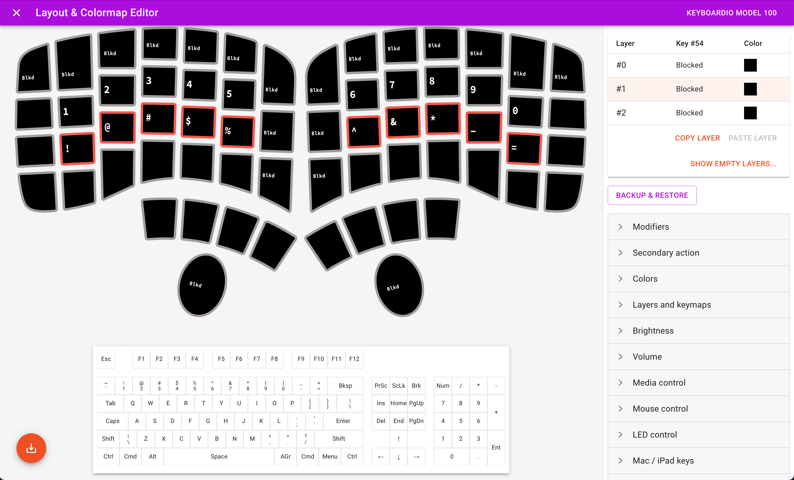

After backing the wildly successful [Keyboardio Model 100](https://shop.keyboard.io/pages/model100) [Kickstarter campaign](https://www.kickstarter.com/projects/keyboardio/model-100) last year, I finally received my keyboard in the mail 🥳

The keyboard is ✨beautiful✨ and the custom-sculpted keycaps feel really great to type on.  After using the Model 100 for a couple weeks now, I've finally settled on a 40%-ish (3 rows of keys) keymap that feels really natural for me.

Although this keymap works really well for me personally, it's probably not the right keymap for everyone. The Model 100 is a roughly 60%-ish (4 rows of keys) keyboard, so **it may seem odd that I'm only using 44 of the 64 available keys on the keyboard**. I thought it might be interesting to walk through my thought process step-by-step and discuss some of the requirements that drove the decisions about where to map each key.

# tldr; [Final](https://twitter.com/laen/status/1404208093098123271) Keymap

If you don't care to read the details below, here's the summary of the final keymap.

There are 3 layers:

- **Layer #0:** Default
- **Layer #1:** Symbols and Numbers
- **Layer #2:** Navigation and Function Keys

Here's the keymap file for [Chrysalis](https://github.com/keyboardio/Chrysalis) if you want to try it out yourself: [model100_keymap_40_percent_space-cadet.json](keymaps/model100_keymap_40_percent_space-cadet.json)

#### Layer #0: Default

This layer is active by default.

#### Layer #1: Symbols and Numbers

This layer is active when the `Bksp` key in the left thumb cluster is held.

#### Layer #2: Navigation and Function Keys

This layer is active when the `Del` key in the left thumb cluster is held.

# Requirements and Rationale

The remainder of this article details the specific requirements and rationale for the location of each key in the keymap.

##### **Requirement #1:** Only use keys adjacent to the home keys.

I've always found the number and function rows awkward to reach on a standard ANSI keyboard because they are more than one row away from the home row. When I try to reach these keys, I have to pull my fingers off the home row keys. It always takes me a second or two to reorient my hands back to the home keys, and I wanted to eliminate this movement when using the Model 100.

In the image below of the standard ANSI keymap, the yellow keys are the home keys for each hand, the green keys are at most one row away from the home row, and the red keys are more than one row away from the home row (the blue space key is a thumb key):

Similarly, on the Model 100, I found it awkward to reach any key more than one row/column away from the home row keys. **By only using keys adjacent to the home keys, I'm able to keep my fingers "docked" on the home keys at all times.** In the image below, the yellow keys are the home  keys, the green keys are one row/column away from the home row, and the red keys are more than one row/column away from the home row (the blue space keys are thumb keys and the purple keys are the palm keys):

As a result, I blocked the 18 red keys on all layers:

##### Requirement #2: Don't use the palm ("fun") keys on the Model 100.

This is probably my most controversal requirement given that the palm key is arguably the Model 100's most unique feature, so I expect this is the point in the article where most Model 100 owners are gonna be like "*this guy's nuts…I'm out* 🪂"

However, I have larger hands and I found the palm ("fun") keys on the Model 100 *really* uncomfortable to press with my palms (it requires rotating my wrists inwards in a really unnatural way for me). Maybe I'm doing it wrong? 🤷🏻‍♂️ 

Once I removed the palm keys and switches completely, the keyboard became much more comfortable for me to use:

In addition, my "daily driver" keyboard before the Model 100 was an [ErgoDox 76 "Hot Dox"](https://kono.store/products/ergodox-hotdox) from [Alpaca Keyboards](https://alpacakeyboards.com/). I wanted the ability to use the [same keymap](#ergodox-76-hot-dox-keymap) on the Model 100 and the Hot Dox, and since the Hot Dox doesn't have palm keys, I didn't want a keymap on the Model 100 that was dependent upon the palm keys.

Based on this requirement, I also blocked the palm keys on all layers, giving a total of 20 blocked keys:

##### Requirement #3: Maintain compatibility with the standard ANSI keymap.

I spend roughly 50% of my time typing on the built-in laptop keyboard on my MacBook Pro. I didn't want to have a completely different keymap on the Model 100 vs. the keyboard on my laptop. For me, maintaining compatibility (as much as possible) with the ANSI standard keymap on my laptop keyboard was a primary goal. Letter keys, default layer symbols, `Tab` and `Shift` keys are all in their standard positions.

However, given the physical layout of the keys on the Model 100, there are some exceptions:

- Since I'm not using keys more than one row/column away from the home keys ([Requirement #1](#requirement-1-only-use-keys-adjacent-to-the-home-keys)), the number and shifted symbol keys need to be on a different layer.
- I hardly ever use the `Caps` key, so I remapped this to `` ` `` which I use frequently (more on this in [Requirement #5](#requirement-5-one-handed-use-of-command---tab-and-command-------on-the-default-layer) below).

Also, the Model 100 has eight thumb keys while a standard ANSI layout only has a single spacebar. On my laptop I use both the left and right `command ⌘` keys frequently, and I'm used to having them tucked under my index finger, so I placed them on the outermost thumb keys.

On the left thumb cluster I placed the `Bksp` and `Del` keys, with the most frequently used `Bksp` key under the left "home" thumb key.  I also wanted the ability to easily type keyboard shortcuts with the `Ctrl` key (e.g. `Ctrl` + `C` when working in the terminal), so I placed that on the left thumb cluster in the innermost position.

On the right thumb cluster I placed the `Enter` and `Space` keys, with the most frequently used `Space` key under the right "home" thumb key. I wanted the ability to type keyboard shortcuts with the `Alt` key (`option ⌥` on macOS), so I placed that on the right thumb cluster in the innermost position.

##### Requirement #4: Space Cadet - tap `shift` for parenthesis symbols `(` and `)`

On a standard ANSI keyboard, the parenthesis symbols `(` and `)` are located in the symbol row (`shift` + `9` and `shift` + `0` respectively). However, I type parenthesis frequently when programming (more often than `{}` or `[]`), so I wanted to be able to type them with a single, unchorded keypress. 

On the Hot Dox keyboard I used previously, I enabled the [QMK Space Cadet feature](https://github.com/qmk/qmk_firmware/blob/master/docs/feature_space_cadet.md) which enables "tapping" the left and right `shift` keys to type  `(` and `)` respectively (holding the shift keys cause them to function like normal shift keys). Luckily, the [Kaleidoscope firmware](https://github.com/keyboardio/Kaleidoscope) on the Model 100 also supports this same [Space Cadet feature](https://kaleidoscope.readthedocs.io/en/latest/plugins/Kaleidoscope-SpaceCadet.html). I've built up a strong muscle memory around this Space Cadet feature over the years, so it was important to me that the `shift`/`()` keys were typed by the pinky fingers, rather than by the thumbs as prescribed the default Model 100 keymap.

##### Requirement #5: One-handed use of `command ⌘` + `tab` and `command ⌘`  + `` ` `` on the default layer.

I *constantly* use `command ⌘` + `tab` and `command ⌘` + `` ` `` to switch between open apps on macOS.  I wanted to have these keys available on the default layer and be able to type them comfortably with my left hand.  Additionally, I like to have the `tab` and `` ` `` keys adjacent to each other, since they are used for switching to the next and previous apps respectively.

##### Requirement #6: A single layer for all symbol and number keys.

I wanted to leverage my existing muscle memory for the number keys by keeping them roughly in the same relative order and location as a standard ANSI keyboard.  Since I'm not using the top row on the Model 100 ([Requirement #1](#requirement-1-only-use-keys-adjacent-to-the-home-keys)), it felt really natural to locate the number keys on `Layer #1`, one row above the home row. It's the same reflex movement, I just don't have to reach as far.

I use symbols even more frequently than numbers when programming, so I wanted to locate them on the home row to make them easily accessible.  In addition, I have existing muscle memory for the relative order of the shifted symbols on a standard ANSI keyboard (i.e. `` !@#$%^&*() ``). I wanted to preserve that same relative order in the Model 100 keymap, locating them directly underneath the corresponding number key on `Layer #1` so they were easy to remember.

However, since the parenthesis symbols `(` and `)` are already mapped to the shift keys ([Requirement #4](#requirement-4-space-cadet---tap-shift-for-parenthesis-symbols--and-)), there is no need to duplicate the parenthesis in the home row. Removing them frees up two extra keys on the home row. When programming, I use `_` and `=` symbols most frequently, so I wanted them located on the home keys. On my MacBook Pro keyboard, I typically type `_` with my right ring finger and `=` with my right pinky finger, so I settled on `` !@#$%^&*_= `` as the final order of symbols directly underneath the number keys on the home row.

This leaves two additional open keys in the home row for symbols:

- one to the left of `!`
- one the right of `=`

I located `~` to the left of `!` to match the normal location on a standard ANSI keyboard.

This leaves the `+` and `-` keys remaining to be placed. On a standard ANSI keyboard, I have existing muscle memory for typing the `+` key in the top right with my right pinky finger, so I located the  `+` and `-` keys vertically in the rightmost column (as a bonus, the placement of `+` directly above `-` just makes logical sense in my brain).

The only remaining symbols that need to be placed are the curly braces `{}` and brackets `[]`.  I find that I type `{}` more frequently than `[]`, so I located `{}` under my right index and middle fingers (slightly easier to type).

Also, since there is one open key to the left of the `{` key, I placed the macOS "globe" `🌐` key for easily typing emoji on macOS/iOS 👍

##### Requirement #7: Left-handed typing of `ESC` 

For some apps, I need to be able to type the `ESC` key with my left hand while mousing with my right hand.  In addition, I have existing muscle memory for typing `ESC` in the top left of the keyboard with my left pinky finger.  I placed the `ESC` key in the one open key to the left of the `1` key on `Layer #1`.

##### Requirement #8: One-handed access to function keys

For some apps, I need to be able to type the function keys with my left hand while mousing with my right hand. I ended up placing the function keys in the four home columns of `Layer #2` which makes them super easy to type one-handed.

##### Requirement #9: Navigation and Media Keys

The main goal for the navigation layer (`Layer #2`) was to have arrow keys on the home row that mimicked the arrow keys on my MacBook Pro keyboard.  I ended up placing them on the `IJKL` keys so that I don't need to shift my fingers around at all (trying to learn Vim-style `HJKL` navigation makes me wee brain crazy 🤯)

I use the `Home` and `End` keys for navigating to the beginning and end of a line in text editors, so I placed these keys in the top right and left corners of the arrow nav cluster. The `PgUp` and `PgDn` keys are also located so that they can be easily typed with my pinky finger without my hand leaving the home row.

I also included Media keys for controlling the volume and brightness, but I use these relatively infrequently, so they got bumped to the outer columns.

For completeness with the standard ANSI keymap, I included `Prsc`, `ScLk`, `Brk`, and `Ins`, but honestly, I don't think I've ever used those keys in my whole life...

To control the LEDs in the Model 100, I also added `LED NExt` and `LED Prev.` keys next to the function keys.

Finally, I added `Caps` in the standard ANSI location.

##### Requirement #10: Shift layers using secondary actions on thumb keys

Now that the 1st and 2nd layers are mostly defined, we need a way to activate them.

To access `Layer #1` I assigned a secondary action to the `Bksp` key in the left thumb cluster.  When the `Bksp` key is held `Layer #1` becomes active, but a backspace is typed when the `Bksp` key is tapped instead of held.

To access `Layer #2` I assigned a secondary action to the `Del` key in the left thumb cluster.  When the `Del` key is held `Layer #2` becomes active, but a delete is typed when the `Del` key is tapped instead of held.

##### Requirement #11: Lock Layers

Normally, accessing the 1st and 2nd layers requires holding the `Bksp` or `Del` keys to shift to the other layer.  There are some cases where I want to turn on a layer and keep it on without holding the layer shift key.  Both the 1st and 2nd layers have the `B` key open, so I assigned this key to function as "lock layer" on each layer.  I like using the `B` key for this because it's one of the keys that is slightly harder for me to type, so there is less chance I'll activate the layer lock by accident.

##### Requirement #12: Block unused keys on layers

Even though I'm already blocking 20 of the 64 keys on the Model 100, there are still a couple keys on the function layers I haven't found a good use for yet. To prevent these keys from accidentally typing something from the default layer, I blocked any unused keys on those layers rather than leaving them transparent.

# ErgoDox 76 "Hot Dox" Keymap

I've included a similar keymap for the  [ErgoDox 76 "Hot Dox"](https://kono.store/products/ergodox-hotdox) from [Alpaca Keyboards](https://alpacakeyboards.com/).

You can download the keymap for [QMK Configurator](https://config.qmk.fm/) here: [hotdox_keymap_40_percent_space-cadet.json](keymaps/hotdox_keymap_40_percent_space-cadet.json)

There are some slight differences between this keymap for the HotDox and the one described above for the Model 100:

- Symmetric `Ctrl` and `Alt` keys typed by pinky fingers
- QMK [doesn't support](https://github.com/qmk/qmk_firmware/issues/2179) the macOS "globe" `🌐` key for typing emoji
- QMK [doesn't support](https://github.com/qmk/qmk_firmware/issues/16861) the "LockTo" layer lock

These differences are highlighted in red in the keymap below:

# Variations

For folks that don't want to enable Space Cadet, here's a variation on `Layer #1` which provides dedicated keys for `(` and `)`.

# Typing practice

If you want to try practicing typing with the keymap above, check out the following sites:

- For programming practice: https://typing.io/
- For word processing/chat practice: https://monkeytype.com/

# Feedback

Anything I got wrong? Problems you've found using this layout?

Do you have a reduced keymap you're currently using with the Model 100 or ErgoDox?

If so, let me know in the comments below. I'd love to hear from you!
