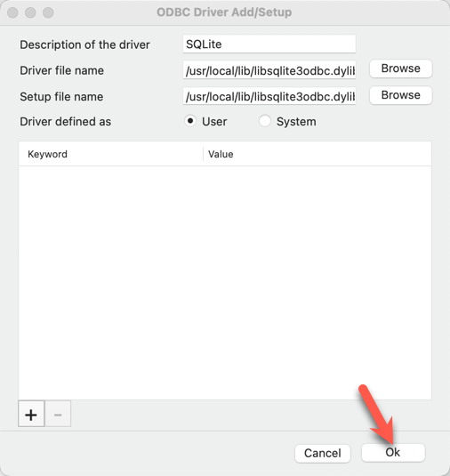

# Overview

A new "Database Libraries" feature was [recently added](https://gitlab.com/kicad/code/kicad/-/issues/7436) to the KiCad [macOS Nightlies](https://downloads.kicad.org/kicad/macos/explore/nightlies) (6.99) and is scheduled to be officially released in KiCad 7. Here's an overview from the [documentation](https://docs.kicad.org/master/en/eeschema/eeschema.html#database_libraries):

> A database library is a type of KiCad symbol library that holds data about parts in an external SQL database. Database libraries do not contain any symbol or footprint definitions by themselves. Instead, they **reference** symbols and footprints found in other KiCad libraries. Each database library entry maps a KiCad symbol (from another library) to a set of properties (fields) and usually a KiCad footprint (from a footprint library).
>
> Using database libraries allows you to create fully-defined parts (sometimes called **atomic parts**) out of KiCad symbols and footprints without needing to store all the part properties in a symbol library. The external database can be linked to third-party tools for managing part data and lifecycles. Database library workflows are generally more complex than the standard KiCad library workflows, and so this type of library is typically only used in situations where it makes managing a large library of fully-defined parts more efficient (such as in organization or team settings).

In this article, I'm going to show you how to configure KiCad to use a SQLite-based database library with KiCad on macOS running on Apple Silicon.

# SQLite ODBC Driver setup on macOS

The initial implementation of the database libraries feature only supports [Open Database Connectivity (ODBC)](https://en.wikipedia.org/wiki/Open_Database_Connectivity) connections to SQL databases. An ODBC driver is needed to provide a translation layer between KiCad and the underlying SQL database implementation ([SQLite](https://www.sqlite.org/index.html), [Postgres](https://www.postgresql.org/), etc).

Normally, the SQLite and the SQLite ODBC driver can be simply installed via homebrew:

```bash
brew install sqlite sqliteodbc
```

However, KiCad is currently compiled as an Intel (`x86_64`) application and runs on Apple Silicon using the [Rosetta translation layer](https://developer.apple.com/documentation/apple-silicon/about-the-rosetta-translation-environment).  As a result, KiCad requires an ODBC driver compiled for the same architecture (`x86_64`).  Running `brew install sqliteodbc` on homebrew for Apple Silicon will install the ODBC driver compiled for `arm64`, rather than the `x86_64` one. This will cause [an error](https://forum.kicad.info/t/kicad-the-case-for-database-driven-design/34621/137?u=cdwilson) like the following:

```
Symbol library 'qa_dblib' failed to load.

Could not load database library: could not connect to database KiCad (/Users/vagrant/kicad/thirdparty/nanodbc/nanodbc/nanodbc.cpp:996: 0100: [unixODBC][Driver Manager]Can't open lib '/opt/homebrew/Cellar/sqliteodbc/0.9998/lib/libsqlite3odbc.so' : file not found )
```

Instead, we need to install homebrew for `x86_64`, and use that homebrew to install `sqliteodbc` for `x86_64`.

#### Install Rosetta 2

Make sure Rosetta2 is installed:

```bash
/usr/sbin/softwareupdate --install-rosetta --agree-to-license
```

#### Create a duplicate terminal app that runs under Rosetta 2 (x86_64)

Create a duplicate terminal app (iTerm.app, Terminal.app, etc):


Rename the duplicate terminal app to make it clear that it's running under Rosetta2 (I appended `x86_64` to the app's file name):


Right click on the duplicate terminal app and choose "Get Info":


Check the "Open with Rosetta" checkbox:


#### Install homebrew for x86_64

Open the duplicate x86_64 terminal app and install homebrew:

```bash
/bin/bash -c "$(curl -fsSL https://raw.githubusercontent.com/Homebrew/install/HEAD/install.sh)"
```

#### Install the SQLite ODBC Driver

Install the x86_64 [SQLite ODBC Driver](http://www.ch-werner.de/sqliteodbc/):

```bash
brew install sqliteodbc
```

#### Install GUI Apps

Install DB Browser for SQLite from https://sqlitebrowser.org/dl/ to browse and edit SQLite database files.

Install iODBC driver manager from https://www.iodbc.org/dataspace/doc/iodbc/wiki/iodbcWiki/Downloads to manage the ODBC driver configuration.

#### Configure the ODBC Driver

If `~/Library/ODBC/` doesn't already exist, you'll get the following error when trying to save "User" settings in the iODBC driver manager:


So, make sure the directory exists:

```bash
mkdir -p ~/Library/ODBC/
```

Run `iODBC Administrator.app` and open the "ODBC Drivers" tab.  

Click the "Add a driver" button:


In the dialog box, input the following settings and click "OK":

**Description of the driver:** `SQLite`

**Driver file name:** `/usr/local/lib/libsqlite3odbc.dylib`

**Setup file name:** `/usr/local/lib/libsqlite3odbc.dylib`

**Driver defined as:** `User`



Click "OK" to save the settings:


This will write the following ODBC configuration files to `~/Library/ODBC`:

- `odbc.ini`
- `odbcinst.ini`

In this simple example, `odbc.ini` will be empty and `odbcinst.ini` should contain the following config:

```ini
[ODBC Drivers]
SQLite = Installed

[SQLite]
Driver = /usr/local/lib/libsqlite3odbc.dylib
Setup  = /usr/local/lib/libsqlite3odbc.dylib
```

# Create a test KiCad project

Now that SQLite and the SQLite ODBC driver is set up, we can test the new KiCad database library feature.

Create a new KiCad project `test-dblib`:


For simplicity, we're going to use a pre-made database library provided by the KiCad developers.  

Download the following files from https://gitlab.com/kicad/code/kicad/-/tree/master/qa/data/dblib:

- `database.sqlite`
- `qa_dblib.kicad_dbl`

Copy both of these files into the KiCad project directory:


Open the `qa_dblib.kicad_dbl` file in a text editor and make sure the `Driver` and `Database` values are correct. The value for `Driver` should match the value specified in `odbcinst.ini`, which in this example is `SQLite`. The value for database is `${CWD}/database.sqlite` since the SQLite database file is located in the same directory as the `.kicad_dbl` file.


Open the Symbol Libraries editor by clicking on "Preferences" → "Manage Symbol Libraries…" and then click on the "Project Specific Libraries" tab (this process is the same if you wanted to add this to the global libraries instead).


Select the `qa_dblib.kicad_dbl` in the file chooser:


Click OK to add the database library to the symbol library table:


Now, open the schematic, choose "Place" → "Add Symbol", and you should be able to choose a symbol from the database library! 🥳


# Browse the database directly

You can browse/edit the SQLite database file directly using the `DB Browser for SQLite.app`. Open the `database.sqlite` library file in DB Browser for SQLite:


You can view the database schema:


 Or browse the data contained in the tables:


# Feedback

Anything I got wrong? Let me know in the comments below.
