

On December 11, 2022 the KiCad team [announced](https://social.adamwolf.org/@adamwolf/109496840211680309) support for macOS universal builds in the 6.99 [nightly releases](https://www.kicad.org/download/macos/). Using a universal build greatly simplifies the process of setting up database libraries and is *strongly recommended*. If you are using an older `x86_64` nightly build released before December 12, 2022 on a Mac with Apple Silicon (i.e. the file does *NOT* start with `kicad-unified-universal`), make sure to follow the old instructions found here:

https://cdwilson.dev/articles/kicad-database-libraries-on-apple-silicon/



# Overview

A new "Database Libraries" feature was [recently added](https://gitlab.com/kicad/code/kicad/-/issues/7436) to the KiCad [macOS Nightlies](https://downloads.kicad.org/kicad/macos/explore/nightlies) (6.99) and is scheduled to be officially released in KiCad 7. Here's an overview from the [documentation](https://docs.kicad.org/master/en/eeschema/eeschema.html#database_libraries):

> A database library is a type of KiCad symbol library that holds data about parts in an external SQL database. Database libraries do not contain any symbol or footprint definitions by themselves. Instead, they **reference** symbols and footprints found in other KiCad libraries. Each database library entry maps a KiCad symbol (from another library) to a set of properties (fields) and usually a KiCad footprint (from a footprint library).
>
> Using database libraries allows you to create fully-defined parts (sometimes called **atomic parts**) out of KiCad symbols and footprints without needing to store all the part properties in a symbol library. The external database can be linked to third-party tools for managing part data and lifecycles. Database library workflows are generally more complex than the standard KiCad library workflows, and so this type of library is typically only used in situations where it makes managing a large library of fully-defined parts more efficient (such as in organization or team settings).

In this article, I'm going to show you how to configure KiCad to use a SQLite-based database library with KiCad on macOS.

# SQLite ODBC Driver setup on macOS

The initial implementation of the database libraries feature only supports [Open Database Connectivity (ODBC)](https://en.wikipedia.org/wiki/Open_Database_Connectivity) connections to SQL databases. An ODBC driver is needed to provide a translation layer between KiCad and the underlying SQL database implementation ([SQLite](https://www.sqlite.org/index.html), [Postgres](https://www.postgresql.org/), etc).

#### Install SQLite and the SQLite ODBC driver

SQLite and the SQLite ODBC driver can be installed via homebrew:

```bash
brew install sqlite sqliteodbc
```

#### Install GUI Apps

Install DB Browser for SQLite from https://sqlitebrowser.org/dl/ to browse and edit SQLite database files.

Install iODBC driver manager from https://www.iodbc.org/dataspace/doc/iodbc/wiki/iodbcWiki/Downloads to manage the ODBC driver configuration.

#### Configure the ODBC Driver

If `~/Library/ODBC/` doesn't already exist, you'll get the following error when trying to save "User" settings in the iODBC driver manager:


So, make sure the directory exists:

```bash
mkdir -p ~/Library/ODBC/
```

Run `iODBC Administrator.app` and open the "ODBC Drivers" tab.  

Click the "Add a driver" button:

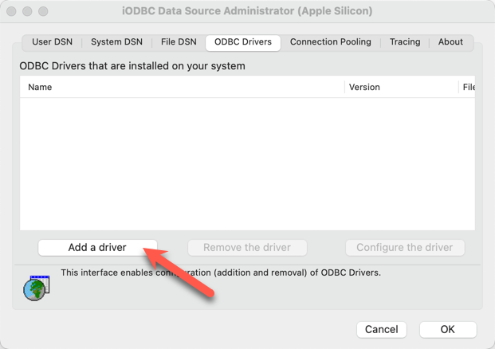

Homebrew installs the ODBC driver in a different location depending on whether homebrew was installed for an Intel (`x86_64`) or Apple Silicon (`arm64`) based Mac. Make sure to use the correct paths for your system and click "OK" in the dialog box:


  
  **Description of the driver:** `SQLite3`

  **Driver file name:** `/usr/local/lib/libsqlite3odbc.dylib`

  **Setup file name:** `/usr/local/lib/libsqlite3odbc.dylib`

  **Driver defined as:** `User`
  

  
  **Description of the driver:** `SQLite3`

  **Driver file name:** `/opt/homebrew/lib/libsqlite3odbc.dylib`

  **Setup file name:** `/opt/homebrew/lib/libsqlite3odbc.dylib`

  **Driver defined as:** `User`
  


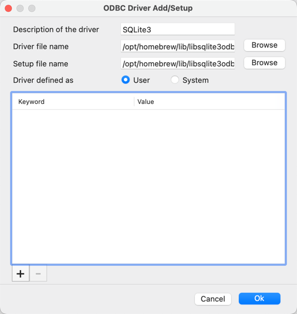

Click "OK" to save the settings:

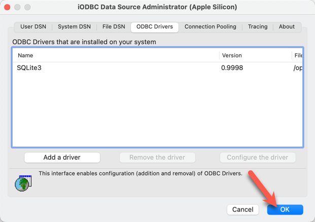

This will write the following ODBC configuration files to `~/Library/ODBC`:

- `odbc.ini`
- `odbcinst.ini`

In this simple example, `odbc.ini` will initially be empty and `odbcinst.ini` should contain the following config:


  
```ini
[ODBC Drivers]
SQLite = Installed

[SQLite]
Driver = /usr/local/lib/libsqlite3odbc.dylib
Setup  = /usr/local/lib/libsqlite3odbc.dylib
```
  

  
```ini
[ODBC Drivers]
SQLite = Installed

[SQLite]
Driver = /opt/homebrew/lib/libsqlite3odbc.dylib
Setup  = /opt/homebrew/lib/libsqlite3odbc.dylib
```
  


# Create a test KiCad project

Now that SQLite and the SQLite ODBC driver are set up, we can test the new KiCad database library feature.

Create a new KiCad project `test-dblib`:

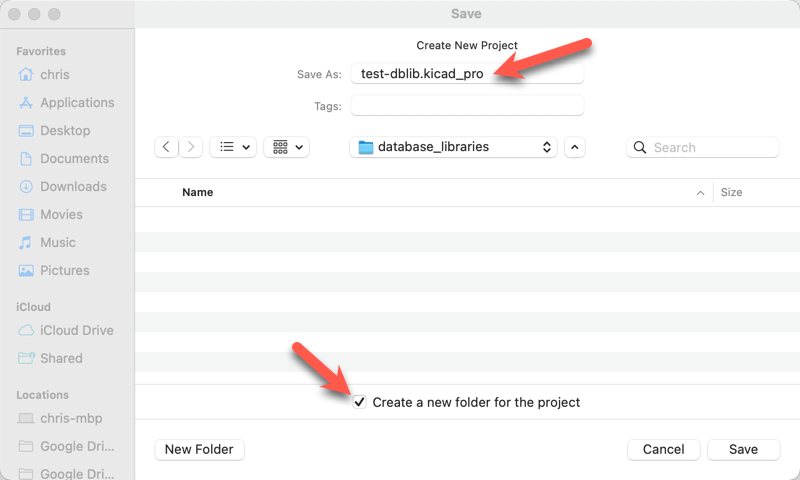

For simplicity, we're going to use a pre-made database library provided by the KiCad developers.  

Download the following files from https://gitlab.com/kicad/code/kicad/-/tree/master/qa/data/dblib:

- `database.sqlite`
- `qa_dblib.kicad_dbl`

Copy both of these files into the KiCad project directory:

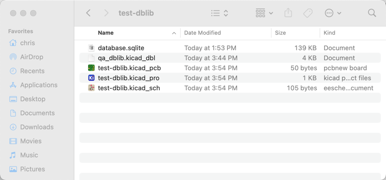

Open the `qa_dblib.kicad_dbl` file in a text editor and make sure the `Driver` and `Database` values are correct. The value for `Driver` should match the value specified in `odbcinst.ini`, which in this example is `SQLite3`. The value for database is `${CWD}/database.sqlite` since the SQLite database file is located in the same directory as the `.kicad_dbl` file.

```json
{
    "meta": {
        "version": 0,
        "filename": "qa_dblib.kicad_dbl"
    },
    "name": "QA Database",
    "description": "A database for testing purposes",
    "source": {
        "type": "odbc",
        "dsn": "",
        "username": "",
        "password": "",
        "timeout_seconds": 2,
        "connection_string": "Driver={SQLite3};Database=${CWD}/database.sqlite"
    },
    "libraries": [
        ...
    ]
}
```

Open the Symbol Libraries editor by clicking on "Preferences" → "Manage Symbol Libraries…" and then click on the "Project Specific Libraries" tab (this process is the same if you wanted to add this to the global libraries instead).

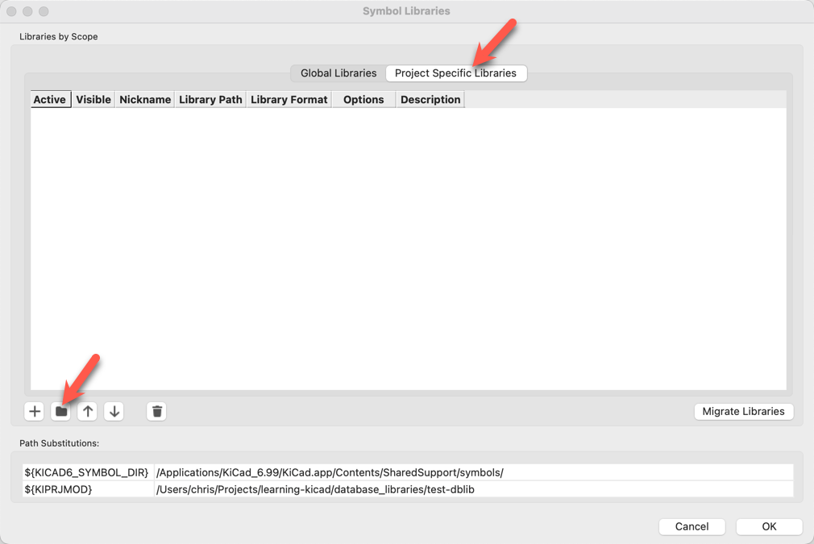

Select the `qa_dblib.kicad_dbl` in the file chooser:

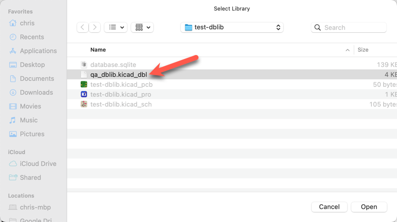

Click OK to add the database library to the symbol library table:

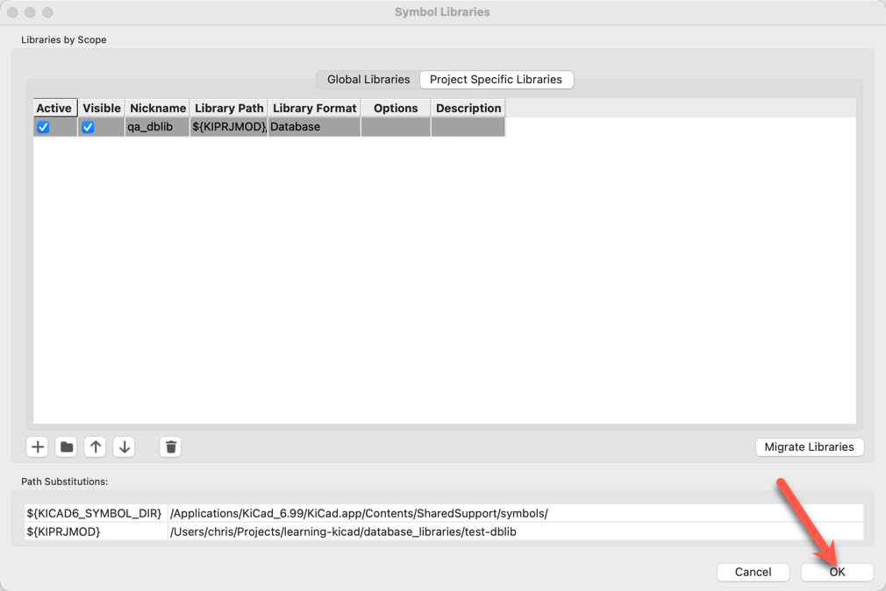

Now, open the schematic, choose "Place" → "Add Symbol", and you should be able to choose a symbol from the database library! 🥳

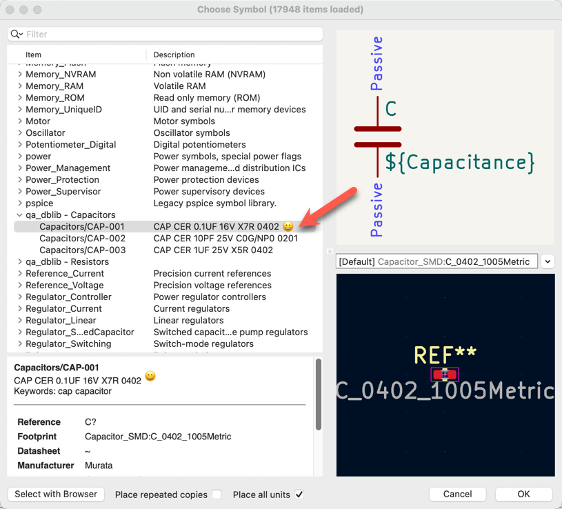

# Browse the database directly

You can browse/edit the SQLite database file directly using the `DB Browser for SQLite.app`. Open the `database.sqlite` library file in DB Browser for SQLite:

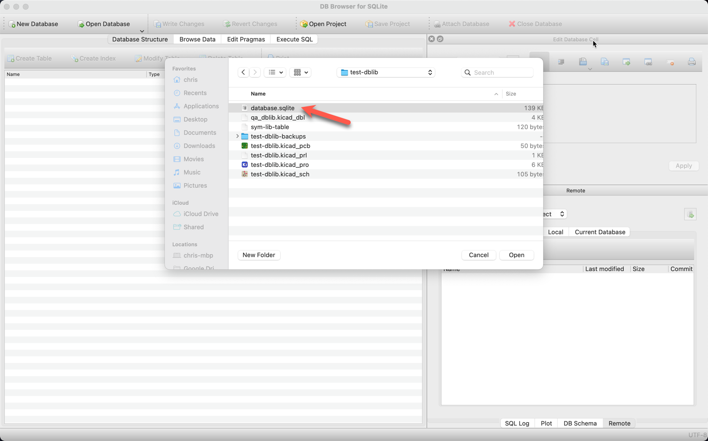

You can view the database schema:

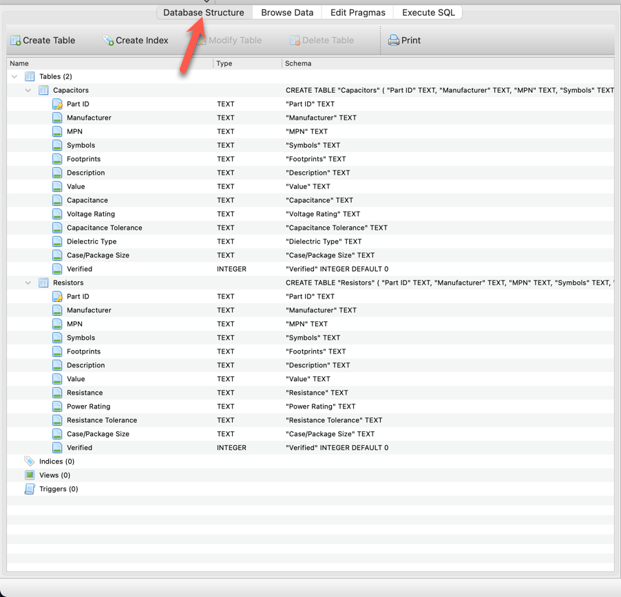

 Or browse the data contained in the tables:

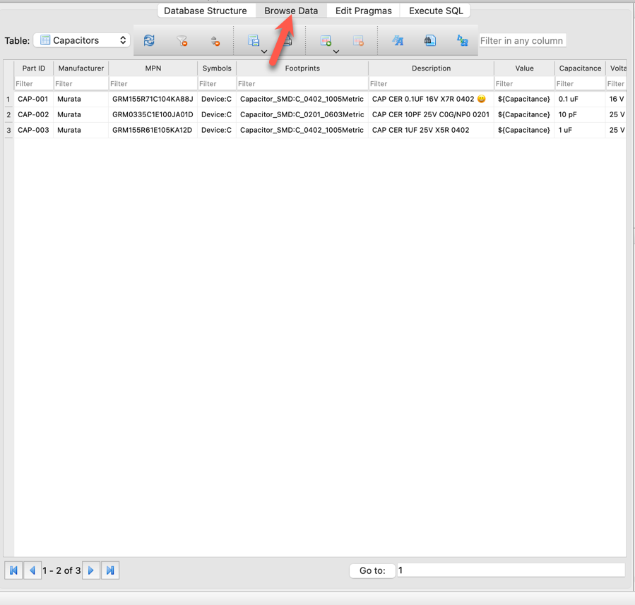

# Feedback

Anything I got wrong? Let me know in the comments below.
