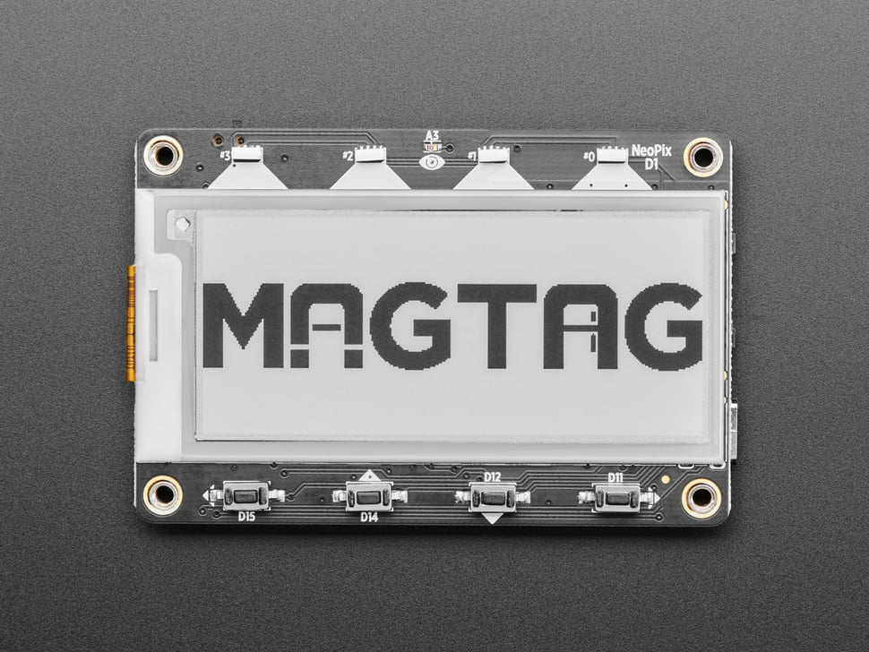
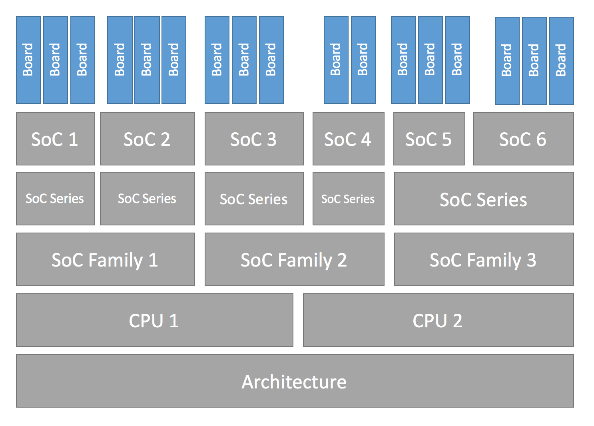
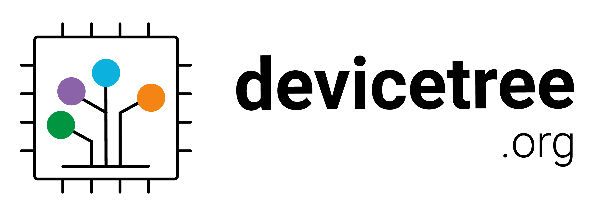

# Overview

Took the Golioth training in December of 2022. It's really great, you should take it if you have a chance! You can even take the self-paced training online for free at https://training.golioth.io/docs/intro.

I went into the training having never used Zephyr or Golioth, so my goal in taking the training was to get a quick overview before diving further into each area. The training is approchable, even for people without extensive background in firmware development, RTOS, or IoT.

However, there was one thing in the training docs that initially confused me. The docs instruct you to build firmware for the [ESP32-S2-Saola-1](https://docs.espressif.com/projects/esp-idf/en/latest/esp32s2/hw-reference/esp32s2/user-guide-saola-1-v1.2.html) board, but then flash that firmware image onto the [Adafruit MagTag](https://www.adafruit.com/product/4800) board purchased for the training. For example, to build the firmware for the Golioth Demo application, you need to specify the `esp32s2_saola` board argument to the `west build` command:

```sh
west build -b esp32s2_saola golioth-demo -p
```

Why are they instructing us to build firmware for a different board? 🤔

It turns out this works because the ESP32-S2-Saola-1 board uses the exact same ESP32-S2 system-on-chip (SoC) as the Adafruit MagTag board. The boards are similar enough that firmware compiled for one board just works on the other[^1].

**Since I wanted to learn more about how to add support for custom boards in Zephyr+Golioth, adding support for the Adafruit MagTag board seemed like a good first place to start.**

In this article, I'll walk you through all the steps required to add the Adafruit MagTag board definition to the Golioth [magtag-demo](https://github.com/golioth/magtag-demo) repository. By the end of the article, you'll be able to pass the `adafruit_magtag` board argument to `west` commands like this:

```sh
west build -b adafruit_magtag golioth-demo -p
```

# Prerequisites

The remainder of this article assumes that you've completed the training at https://training.golioth.io/, specifically the "After Training" tutorial to [Install Zephyr on Your Local Machine: Option A](https://training.golioth.io/docs/after-training/local-toolchain-install#magtag-zephyr). This just ensures that you've got the `magtag-demo` repo installed and working properly so you can follow along with the examples in this article.

However, the process for adding a custom board definition does not have any dependencies on Golioth, you should be able to apply this same process to any Zephyr app whether you're using Golioth or not.

# Understanding "Boards" in Zephyr

Most people reading this article will have an intuitive sense of what a board is, but Zephyr has a layered architecture that explicitly defines an entity called a "Board" which is distinct from other layers in the architecture like a "CPU" or an "SoC". 



Since we want to add support for a new physical board, we need to understand what a "Board" is in the Zephyr ecosystem.

The [Zephyr glossary defines a board](https://docs.zephyrproject.org/latest/glossary.html#term-board) this way:

> A target system with a defined set of devices and capabilities, which can load and execute an application image. It may be an actual hardware system or a simulated system running under QEMU. The Zephyr kernel supports a [variety of boards](https://docs.zephyrproject.org/latest/boards/index.html#boards).

Zephyr already has support for the Xtensa CPU core (`${ZEPHYR_BASE}/arch/xtensa/core/`) and the ESP32-S2 SoC (`${ZEPHYR_BASE}/soc/xtensa/esp32s2/`), so we don't need to add support for these layers. The only thing we need to add is a definition for the board itself.

Let's dig into the Zephyr documentation to see how to add support for a new board.

# Porting Zephyr to a new board

Zephyr has extensive documentation on how to add support for new hardware (see [Porting](https://docs.zephyrproject.org/latest/hardware/porting/index.html)). For this article specifically, I followed the [Board Porting Guide](https://docs.zephyrproject.org/latest/hardware/porting/board_porting.html#board-porting-guide) that covers how to add support for a new board in Zephyr.



The board porting guide provides a generic overview of the porting process for a fake board named "plank", while this article details the specific porting process for Adafruit MagTag board. I think it's helpful to see the end-to-end process for a real board, but because it's tailored for the MagTag board, this article may not exhaustively cover every possible aspect of porting a new board to Zephyr.



Before we can dive in and start adding a new board definition, we need to understand where to put it so the Zephyr build system can find it. Zephyr is flexible and it supports pulling in board definitions from multiple possible sources. To understand where we can put the new MagTag board definition, we need to understand how west workspaces and manifest repositories work.

## Understanding west workspaces and manifest repositories

Building a Zephyr-based firmware image requires pulling in source code for the bootloader, kernel, libraries, and application logic from multiple Git repositories (the Zephyr term for these individual Git repositories is *projects*). Managing these individual repos manually would be a nightmare! Thankfully, Zephyr provides a command line tool named `west` that automatically manages these Git repositories for us. 

West manages all these dependencies inside a top-level directory called a *workspace*. Every west workspace contains exactly one *manifest repository*, which is a Git repository containing a *manifest file*. The manifest file (named `west.yml` by default) defines the Git repositories (*projects*) to be managed by west in the workspace.

West is flexible and supports multiple topologies for application development within a workspace (you can read about all the supported topologies [here](https://docs.zephyrproject.org/latest/develop/west/workspaces.html#topologies-supported)). When I took the Golioth training in Dec 2022, the magtag-demo repo used the [T2: Star topology](https://docs.zephyrproject.org/latest/develop/west/workspaces.html#t2-star-topology-application-is-the-manifest-repository). This means the magtag-demo repo is the *manifest repository* in the west *workspace*, and the [zephyr](https://github.com/zephyrproject-rtos/zephyr) repository is included in the west *manifest file* as a dependency (`deps/zephyr`). 

It looked something like this:

```plaintext
magtag-demo/                           # west "topdir"
├── .west/                             # marks the location of the west topdir
│   └── config                         # per-workspace local west configuration file
│
│   # The manifest repository, never modified by west after creation:
├── app/                               # magtag-demo.git repo cloned here as "app"
│   ├── golioth-demo/                  # Zephyr app for Golioth demo
│   │   └── boards/
│   │       ├── esp32s2_saola.conf     # per-board app software configuration
│   │       └── esp32s2_saola.overlay  # per-board app hardware configuration
│   └── west.yml                       # west manifest file
│
│   # Directories containing dependencies (git repos) managed by west:
└── deps/
    ├── bootloader/
    ├── modules/
    ├── tools/
    └── zephyr/
        └── boards/
            └── xtensa/
                └── esp32s2_saola/     # board definition for ESP32-S2-Saola-1
```

When we run the `west build -b esp32s2_saola` command, the Zephyr build system will look for a board named `esp32s2_saola` in a subdirectory of the `zephyr/boards` directory AND in a subdirectory of `app/boards` (if it exists). As you can see in the hierarchy above, the zephyr repository already includes the board definition for the ESP32-S2-Saola-1 board in the `zephyr/boards/xtensa/esp32s2_saola/` directory, so this is the board definition that is used for the `golioth-demo` application.

However, if you look in the `magtag-demo/app/golioth-demo/boards/` directory, you'll notice files like `esp32s2_saola.conf` and `esp32s2_saola.overlay` that extend the `esp32s2_saola` board definition to enable additional software/hardware configuration like WiFi, LEDs, networking, etc. I'll cover the details of these files later on in this article, but for now, you just need to know that they allow per-board, app-specific  modifications to the base board definitions. **The key takeaway here is that your Zephyr application can use and extend any existing board definition from the upstream `zephyr` repo.**

So, if we want to add a new board definition for our app, there are two places where we could add it:

1. In the upstream `zephyr` repository as `zephyr/boards/xtensa/adafruit_magtag`
2. In the `magtag-demo` repository as `magtag-demo/boards/xtensa/adafruit_magtag`

If we add the board definition into the upstream `zephyr` repository, it would make the board definition available to anybody who uses Zephyr. However, it can take a while for the Zephyr developers to review and approve a PR to add a new board definition. It is also [required to add documentation](https://docs.zephyrproject.org/latest/hardware/porting/board_porting.html#contributing-your-board) for the board as part of the PR, which adds some additional overhead to the submission process.

For now, we're just going to add the custom board definition in the `magtag-demo` repo (as described [here](https://docs.zephyrproject.org/3.2.0/develop/application/index.html#custom-board-devicetree-and-soc-definitions)) so that we can distribute it immediately alongside the Golioth training apps without waiting for it to be upstreamed.

## Create the new board directory

The first step is to create a new directory where we can start adding the board files. Since we're going to be submitting this as a PR, it's good practice to create a new Git feature branch for this work:

```sh
# make sure you're in the magtag-demo git repo (i.e. app/)
cd magtag-demo/app/

# create a new feature branch from the main branch
git checkout -b cdwilson/add-adafruit-magtag-support main
```



While it's not required, I typically like to prefix my branches with my GitHub username (i.e. `cdwilson/branch-name`) so I can easily group and identify my own personal work vs. the work of other developers in the same repo.



Now that we've got a new branch checked out, we can create a new board directory for the MagTag board:

```sh
mkdir -p boards/xtensa/adafruit-magtag
```

## Define the board hardware using Devicetree



In order to generate customized firmware for each supported board, Zephyr needs to have an understanding of each board's hardware configuration. Rather than hard coding all the hardware details of each board into the operating system, Zephyr uses the [Devicetree Specification](https://www.devicetree.org/) (DTSpec) to describe the hardware available on supported boards. Using devicetree, many aspects of the hardware can be described in a data structure that is passed to the operating system at boot time. Using this data structure, the firmware can get information about the underlying hardware through the standard `devicetree.h` API at runtime.



It's easy to get overwhelmed when you first start trying to understand devicetree. Hang in there! You'll soon see that the benefits of devicetree outweigh the initial learning curve.

If you've never worked with devicetree before, I would encourage you to spend some time reading the [Introduction to devicetree](https://docs.zephyrproject.org/latest/build/dts/intro.html) in the Zephyr docs. If you prefer a video introduction, check out Marti Bolivar's talk [A deep dive into the Zephyr 2.5 device model](https://www.youtube.com/watch?v=sWaxQyIgEBY) from the 2021 Zephyr Developer's Summit.

[
](https://training.golioth.io/docs/category/basic-io-exercises)



### adafruit_magtag-pinctrl.dtsi

TODO

### adafruit_magtag.dts

To describe the hardware available on the board, we need to add a human-readable devicetree source (DTS) file:

```plaintext
boards/xtensa/adafruit-magtag
└── adafruit_magtag.dts
```

First, we add a line specifying the devicetree syntax version we're going to be using in the file:

```plaintext
/dts-v1/;
```

TODO: mention that devicetree source files are run through the C preprocessor.

Next, we include the ESP32-S2 SoC devicetree definitions provided by Espressif in `${ZEPHYR_BASE}/dts/xtensa/espressif/esp32s2.dtsi`:

```plaintext
#include <espressif/esp32s2.dtsi>
```

This file defines the hardware available on the ESP32-S2 SoC such as the available CPUs, flash memory, WiFi, GPIOs, etc. Note that many of the peripherals defined in this file are disabled by default (`status = "disabled";`). We'll enable some of these peripherals used on the MagTag board later on in the `adafruit-magtag.dts` file.

## Create the documentation directory (optional)

This step is optional, but it's good practice to create the documentation directory if you're planning to upstream the board definition in the future. The following will copy the Zephyr documentation template and download the board image file from Adafruit's website:

```sh
# create the doc/ and doc/img subdirectories
mkdir -p boards/xtensa/adafruit-magtag/doc/img

# copy the documentation template into the doc directory
cp ${ZEPHYR_BASE}/doc/templates/board.tmpl boards/xtensa/adafruit-magtag/doc/index.rst

# download the board image into the doc/img directory
wget --output-document=boards/xtensa/adafruit-magtag/doc/img/adafruit_magtag.jpg https://cdn-shop.adafruit.com/970x728/4800-11.jpg
```

# Feedback

Anything I got wrong? Let me know in the comments below.

[^1]: The Golioth training repo includes "devicetree overlay" definitions and Kconfig settings that enable some of the additional hardware/software features on the MagTag board that don't exist on the Saola board–I'll discuss what these are in more detail later in the article.
