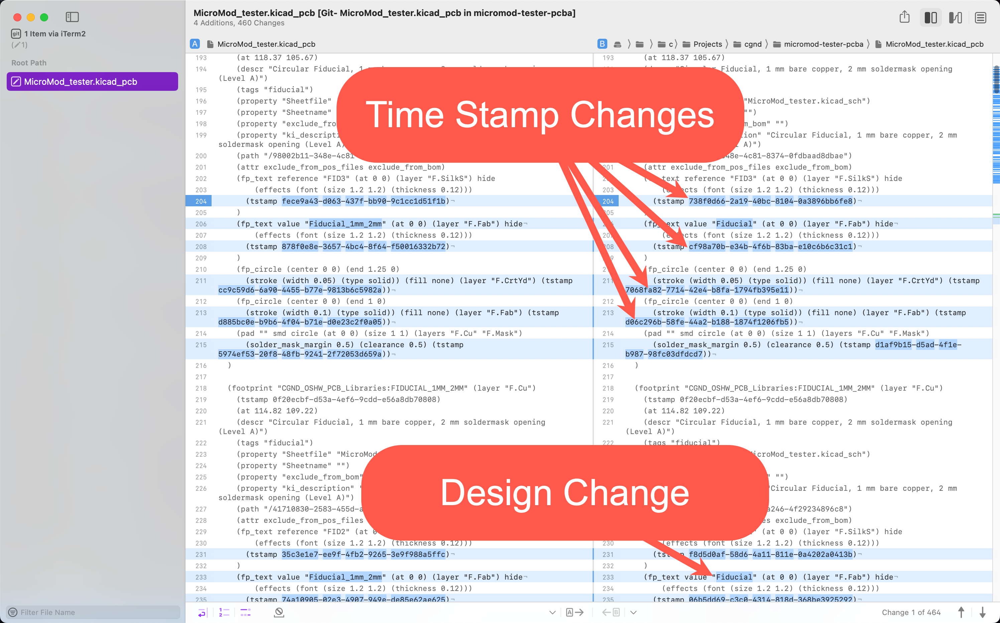
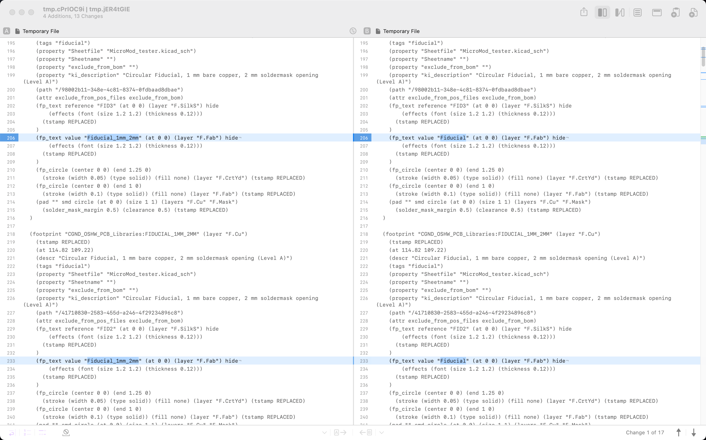

It can be difficult to tell what has actually changed when running `git difftool` on a `.kicad_pcb` file because KiCad embeds timestamps into the file that change when the file is modified:



Luckly, we can tell `git` to use a [custom difftool](https://git-scm.com/docs/git-difftool#Documentation/git-difftool.txt--tlttoolgt) using the `--tool=<tool>` argument.

First, we need to create a custom shell script to pass to `git difftool --tool=<tool>`. I use [Kaleidoscope.app](https://kaleidoscope.app/) as my git difftool on macOS, so I named this script  `kicad-ksdiff` and put it a directory on my `$PATH`:

```bash
#!/bin/bash

# Run with the following command:
# git difftool --tool=kicad-ksdiff board.kicad_pcb

# From https://forum.kicad.info/t/a-better-difftool-for-kicad/40042/3
tstamp() {
  sed -E 's/([(]tstamp )[^)]*/\1-/g' "$@";
}

ksdiff <(tstamp "$1") <(tstamp "$2")
```

Next, we need to configure git to call this script when `git difftool --tool=kicad-ksdiff` is invoked. Put the following in your global `.gitconfig` file:

```plaintext
[diff]
	tool = Kaleidoscope
[difftool "kicad-ksdiff"]
	cmd = kicad-ksdiff $LOCAL $REMOTE
```

Now, running `git difftool --tool=kicad-ksdiff <board>.kicad_pcb` ignores any timestamp changes and only shows changes to the actual design:



## Revision History

| Revision | Date       | Description                                                  |
| -------- | ---------- | ------------------------------------------------------------ |
| 1        | 02/06/2023 | Initial release                                              |
| 2        | 02/07/2023 | Update script based on https://forum.kicad.info/t/a-better-difftool-for-kicad/40042/3 |

# Feedback

Anything I got wrong? Have you found better ways to filter out timestamp changes?

Let me know in the comments below.