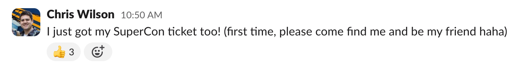
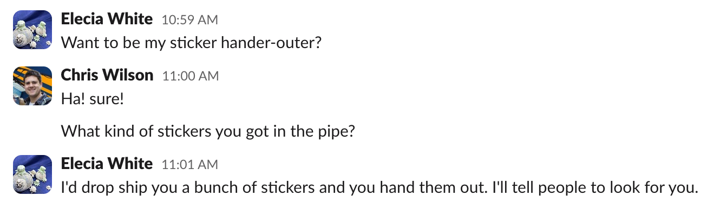
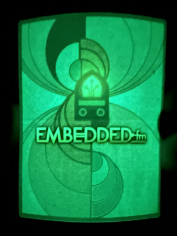
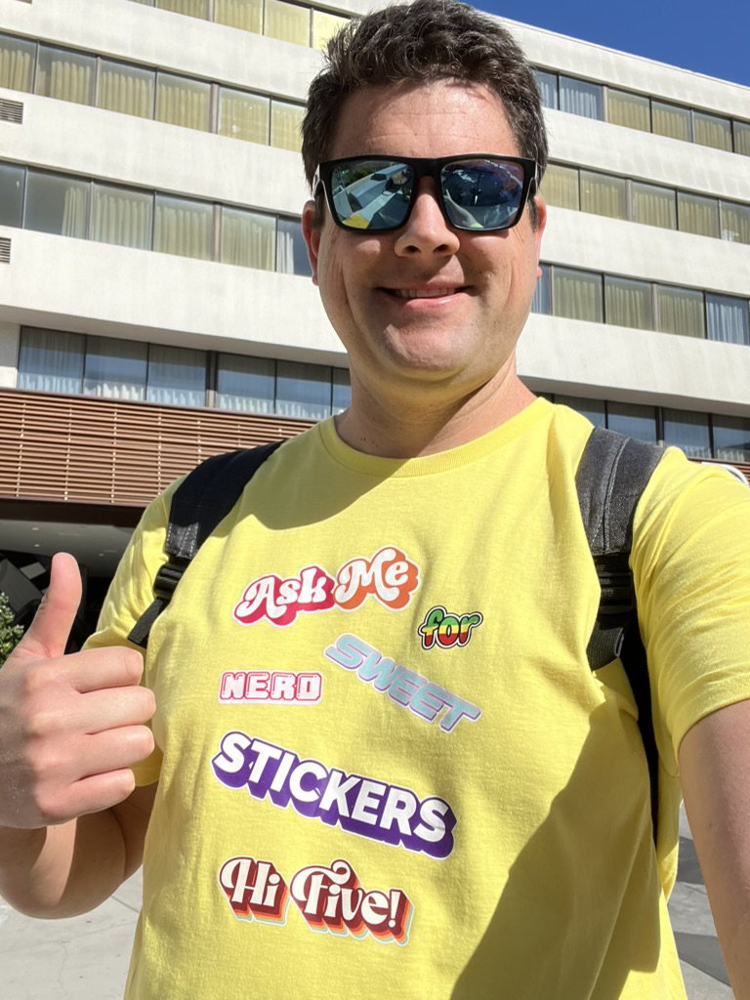
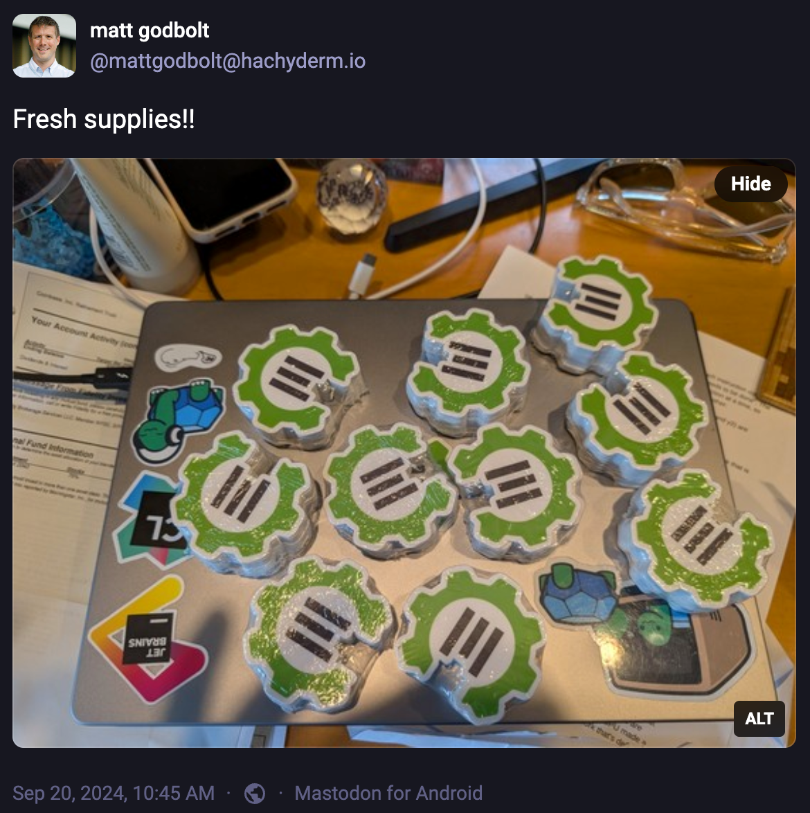
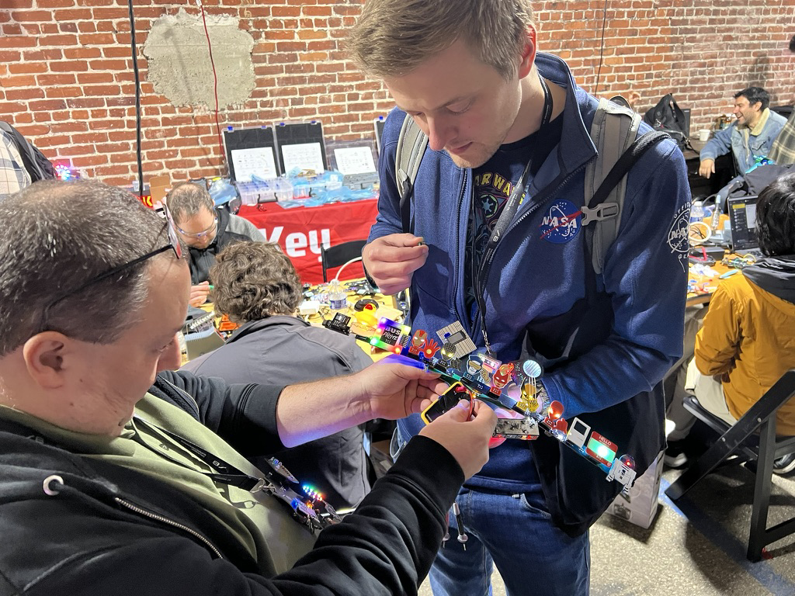

I finally got a chance to sit down and reflect on this past weekend at [Hackaday Supercon 2024](https://hackaday.io/superconference/).

You might expect that a post about Supercon would be all about [epic badge hacks](https://www.youtube.com/watch?v=Iz-HrZkzUlk&t=5124s), or a recap of interesting [talks](https://hackaday.io/superconference/schedule.html), or photos of the (surprisingly good for a conference) food that I ate 🌮

But what I really want to do is tell you a story of how the **kindness** and **generosity** of a bunch of random people made my first Supercon... well... SuperFUN!

### Rewind the timeline

This story actually starts a couple months ago in the `#conference-meetup` channel of the [Embedded.fm](https://embedded.fm/) Slack.

In an offhand comment, I mentioned that I was going to Supercon for the first time.

I had never met or talked with Elecia at this point, but she kindly reached out to me and asked if I wanted to hand out [Embedded.fm](https://embedded.fm/) stickers as a way to meet other folks.

A couple weeks later, a ton of glow-in-the-dark stickers showed up on my doorstep! Thank you for your generosity Elecia! 🙏

With stickers in hand, I was ready to make friends! 👋

But, wait a sec... *how would people know I had stickers to hand out?*

🤔...

🤔...

💡MAKE A SHIRT TO MAKE FRIENDS!

### Moar stickers = Moar better

A couple weeks later, I ran across [a post from Matt Godbolt](https://hachyderm.io/@mattgodbolt/113171124138251893) saying he just got a new batch of Compiler Explorer stickers.

The only thing better than having *one* awesome sticker to hand out at Supercon is having *two* awesome stickers to hand out, right?

So, I sent Matt an email saying I was going to Supercon wearing a ridiculous bright yellow T-shirt with the intention of trading hi-fives for stickers. And that I would love to hand out his stickers.

Mind you, Matt and I have never met. He had no idea who I was or why I was asking him for stickers, and he had never even heard of Supercon.

A couple weeks later, a ton of Compiler Explorer stickers showed up on my doorstep! Thank you for your generosity Matt! 🙏

### Making Friends at Supercon

Fast forward to Nov 1, 2024.

Thanks to Elecia and Matt, I showed up at Supercon with awesome stickers. Thanks to me, I showed up wearing a bright yellow shirt that makes me look like a needy friendless weirdo.

Time to make friends. Hi Five!

For those who have not been to Supercon, Friday is basically just a giant hang-out sesh where everyone attempts to simultaneously stuff their face with pizza and solder 628 LEDs to their badge.

(something something ingesting leaded solder...)

As an introvert, walking into this crowded room by yourself with hundreds of people who all seem to know each other from last year turns out to be kind of intimidating. *Will people be friendly? What is everybody working on? Where do I sit?*

Serendipitously, I found a table with some folks from the [Embedded.fm](https://embedded.fm/) Slack who warmly welcomed me to sit with them. Over the course of the afternoon, I met a bunch of new folks who were excited to give me the [Simple Add-on they designed](https://hackaday.io/contest/197237-supercon-8-add-on-contest) or chat about the MicroPython code they were writing for the badge.

As the weekend progressed, I chatted with Simen Sørensen about his [collection of super hero SAOs](https://mastodon.social/@simenzhor/113266947534371773). Thomas Flummer walked me through how he designed and built each piece of his incredible [SAO Digital Multimeter](). I randomly stood in the dinner line next to Joey Castillo and learned all about the [Sensor Watch](https://www.joeycastillo.com/objects/sensorwatch/) project (and small business accounting). Kevin Santo Cappuccio **gave me** a [Jumperless](https://github.com/Architeuthis-Flux/Jumperless) breadboard 🤯

The icing on the cake for me was seeing my [SAOP](https://hackaday.io/project/198497-saop) SAO [make a cameo in Dave Darko's lightning talk](https://www.youtube.com/watch?v=X9mhiatxZyU&t=2534s) on Simple Add-ons.

Nearly everyone I met was kind and generous.

This past weekend at Supercon was a welcome reminder for me that little acts of kindness and generosity go a long way towards making people feel welcome in a community. Thanks to everyone who made me feel welcome this weekend!

### Tips for new folks

Here's the list of things I wish someone had told me before I showed up at Supercon.

- Check out [Dave Darko's Supercon guide](https://supercon.davedarko.com/) (his calendar is especially helpful for planning which talks to attend).
- Join the [Hackaday Discord Server](https://hackaday.com/discord) to ask questions before and during the event.
- The conference is split between two different buildings (I ran into a couple new people who went to the wrong building):
  - [Supplyframe HQ](https://maps.app.goo.gl/tWKBEQxMKyucYfze6) (elevator is at the end of an alley, they will give you a code to access the 3rd floor)
  - [Supplyframe DesignLab](https://maps.app.goo.gl/DX9vDg22f1fhMc4C6)
- Bring a Simple Add-on, stickers, or something interesting you made. You can use it as a conversation starter or trade them for other people's cool stuff.
  - If you bring something that requires assembly, make sure to include instructions or a link to a site/repo with assembly instructions.
  - Put your name/contact info/social media links on your hand-outs so that people can find you after the conference.
- If you're into badge hacking, bring a portable soldering iron, wire clippers, and other small tools for hacking the badges and add-ons at the conference.
- Sign up early for workshops, they sell out well before the start of the conference.
- Always remember your badge. I left my badge in my hotel the 2nd morning and they wouldn't let me in without it.
- Assume that WiFi will NOT work at the conference.
- If you are flying, bring an extra bag/box to carry home the stuff you got from other people at the con.
- Say hi to people! Talks are recorded, so you can watch them whenever. The people are only there for the weekend, so make the most of your time talking with folks and making friends.

What other tips would you add? Let me know in the comments below.
