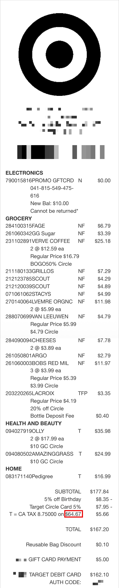

I will send \$100 to the first person who can reverse engineer how [Target](https://www.target.com/) calculated the \$162.10 total amount on this receipt.

This is not a joke. I'm totally serious.

## Rules

The first person to build me a spreadsheet showing exactly how the \$162.10 total amount is calculated (step-by-step with explanation, including how to calculate the \$64.67 taxable amount in the red box), will be sent \$100 via Venmo, PayPal, etc.

I'll update this post as soon as someone replies with a correct solution.

## Hints

All the information you need is provided on the receipt below (it's a real receipt I downloaded from my Target account and has not been altered except to blur out some of my personal information).

FYI, I got a \$10 promotional gift card with this order which shows up as the `PROMO GFTCRD` (\$0) charge on the receipt.

`T` = Taxable item

`N` = Nontaxable item

`F` = Food item

